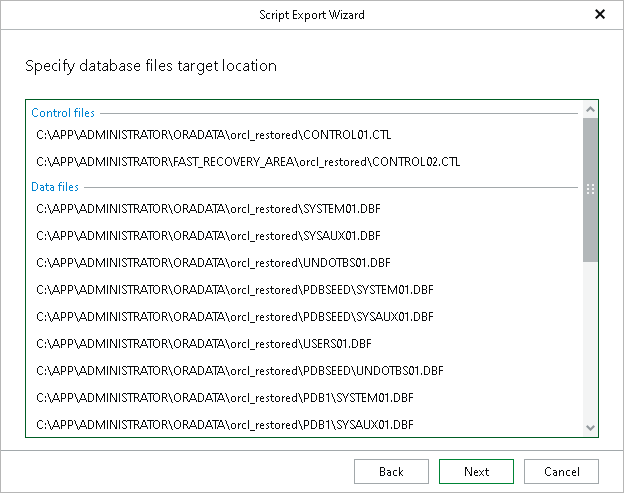

# Step 5. Specify Database Files Location

At this step of the wizard, specify the location to which data files will be restored.

Consider the following:

* When restoring with the Restore with the original name and settings option, only the location for Data files will be available for editing.
* When restoring with the Restore with different name and settings option, the location for the following files will be available for editing:

* Data files
* Log files
* Temp files

|  |
| --- |
| Note |
| Even though the Control files paths are available for editing at this step, the edits will not be applied in the generated recovery script. |

To change the target location, click the row and specify the path.

Page updated 2026-07-16

