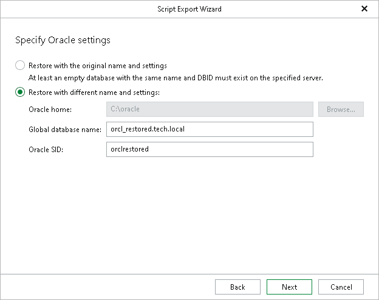

# Step 3. Specify Oracle Settings

At this step of the wizard, specify the location to which you want to restore the database.

* Select the Restore with the original name and settings option to populate the scripts with the original database name and settings saved in the backup.
* Select the Restore with different name and settings option to choose custom settings:

1. The Oracle home field is disabled. Because the wizard does not connect to the target server, Veeam Explorer for Oracle cannot detect the Oracle home path and writes a placeholder into the generated scripts instead. In the script that restores the parameter file, the placeholder appears in the target path of the RESTORE SPFILE TO PFILE command:

|  |
| --- |
| RESTORE SPFILE TO PFILE '[ORACLE\_HOME or ORACLE\_BASE path depends on Oracle version]\database\init<ORACLE\_SID>.ora' FROM '...'; |

Before the database administrator runs the scripts, they must replace [ORACLE\_HOME or ORACLE\_BASE path depends on Oracle version] or the full path with the necessary path on the target server.

1. In the Global database name field, specify the global database name as DB\_NAME.DB\_DOMAIN, where:

* DB\_NAME is the database name. Oracle limits the length of the database name to 8 characters. If the database name you specify exceeds this limit, Veeam Explorer for Oracle will automatically shorten the database name, and hence the global database name, during the restore process.

The value you specify is also used for the unique database name (DB\_UNIQUE\_NAME). The unique database name can contain up to 30 characters.

* DB\_DOMAIN is the domain name of the database. It does not count towards any character limits and Veeam Explorer for Oracle does not shorten it during the restore process.

For example, if you specify the global database name as orcl\_restored.tech.local, Veeam Explorer for Oracle will shorten it to orcl\_res.tech.local. The database name will be orcl\_res, while the unique database name will be orcl\_restored.

The Global database name field is available only if you have selected the Recover database to specific point in time option at the [Specify Recovery Type](rman_export_specify_recovery_type.md) step.

1. In the Oracle SID field, specify the database system identifier. The Oracle SID field is automatically filled with the value entered in the Global database name field, but you can also assign a different value.

The maximum length of the Oracle SID is 12 characters and it can only contain alphanumeric characters (a-z, A-Z and 0-9).

Before running the scripts, the database administrator must set the ORACLE\_SID environment variable to this value so that RMAN connects to the correct target instance.

|  |
| --- |
| Note |
| Consider the following:   * To use the Restore with different name and settings option, make sure that Controlfile Autobackup is enabled. For more information, see [Oracle Environment Planning](oracle_environment_planning.md#abname). * When you select the Restore with different name and settings option, the existing Oracle SID (if any) will be replaced with that from the backup. |

Page updated 2026-07-17

