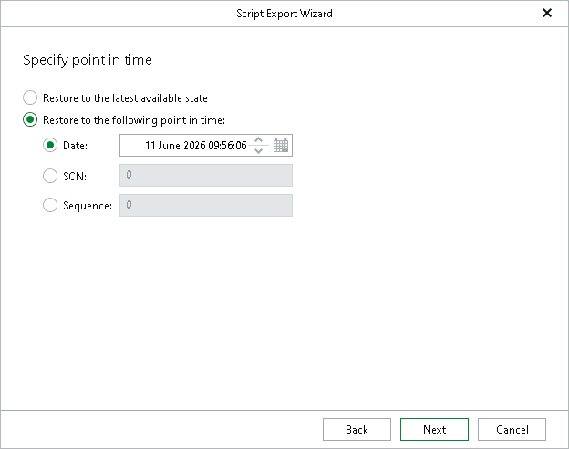

# Step 4. Specify Point in Time

At this step of the wizard, do either of the following:

* Select the Restore to the latest available state option to restore data as of the latest available state.
* Select the Restore to the following point in time option to select a state as of which you want to restore data:

* Select the Date option to specify the date and time of the required state.

|  |
| --- |
| Note |
| The behavior of the wizard depends on the option you selected at the [Specify Oracle Settings](rman_export_specify_oracle_settings.md) step:   * If you selected the Restore with different name and settings option, you can proceed to the next step after you select a point in time with control file autobackups. * If you selected the Restore with the original name and settings option, you can proceed to the next step regardless of the date and time you specify. However, consider the following:  * If a backup exists for the selected point in time, Veeam Explorer for Oracle populates the script with this point in time. * If no backup exists for the selected point in time, Veeam Explorer for Oracle populates the script with the point in time of the latest available backup. * If no backup exists for the selected point in time and no earlier backups are available, Veeam Explorer for Oracle populates the script with the selected date and time, but running the recovery scripts will fail. |

* Select the SCN option to specify the SCN (System Change Number) of the required state.
* Select the Sequence option to specify the log sequence number of the required state.

|  |
| --- |
| Tip |
| For more information on RMAN point-in-time restore settings, see the [Oracle documentation](https://docs.oracle.com/en/database/oracle/oracle-database/21/bradv/rman-performing-flashback-dbpitr.html#GUID-7572C8E9-05B8-4BCC-823F-BD6763C51B11). |

Page updated 2026-07-17

