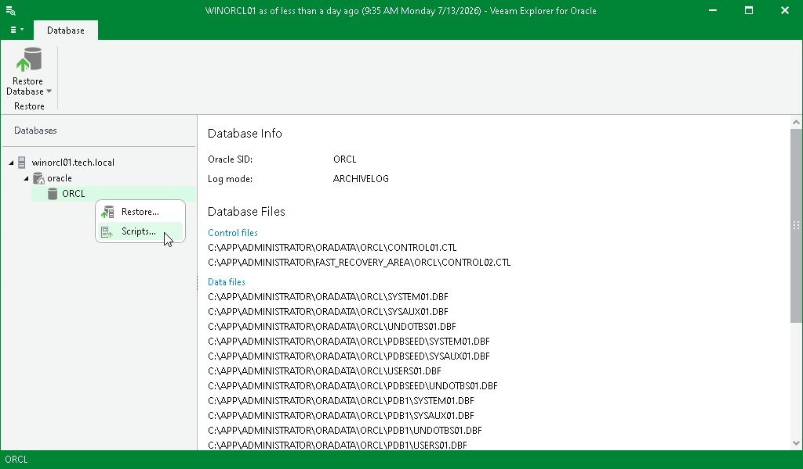

# Step 1. Launch Export Wizard

To launch the Script Export wizard, do the following:

1. Open an RMAN plug-in backup, as described in the [Exploring RMAN Plug-in Backups](veor_exploring_rman.md) section.
2. In the navigation pane, select a database.
3. On the Database tab, select Restore Database > Scripts or right-click a database and select Scripts.

Page updated 2026-07-16

