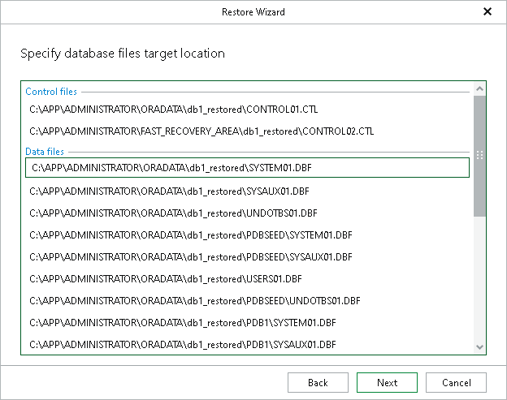

# Step 8. Specify Database Files Location

At this step of the wizard, specify the location to which you want to restore data files.

Consider the following:

* When restoring with the Restore with the original name and settings option, only the location for Data files will be available for editing.
* When restoring with the Restore with different name and settings option, the location for the following files will be available for editing:

* Control files
* Data files
* Log files
* Temp files

To change the location, click the path row and specify the path.

