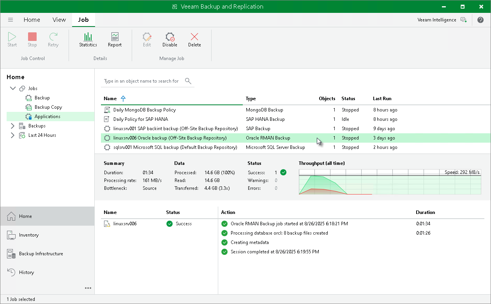
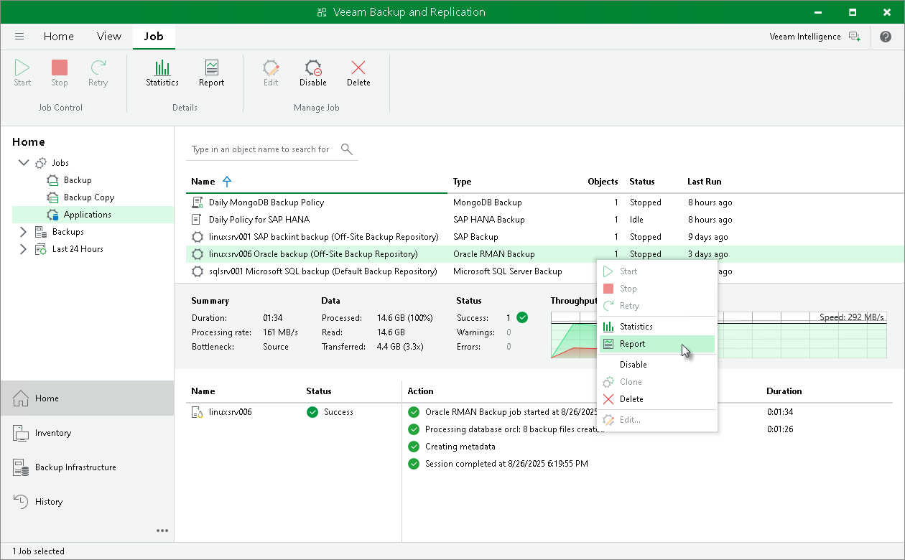
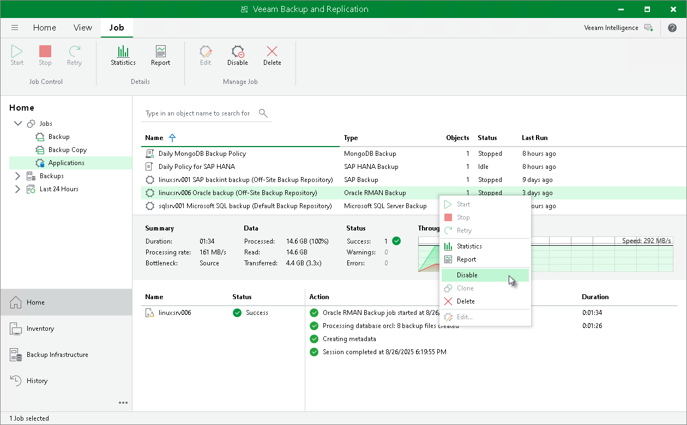

# Backup Job in Veeam Backup & Replication

In this article

|  |
| --- |
| Tip |
| If you want to configure or manage an application backup policy for Veeam Plug-In operating in the managed mode, see [Working with Application Policies](application_policies.md). |

After you start a backup process in Oracle RMAN, Veeam Backup & Replication creates a backup job. You can use this job to view the statistics on the backup process, generate backup job reports or you can also disable the backup job.

You cannot start or edit Oracle RMAN backup jobs in the Veeam Backup & Replication console. You can manage backup operations only on the Oracle side using RMAN.

Consider the following regarding the naming of Oracle RMAN backup jobs:

* For a standalone Oracle RMAN server, Veeam Backup & Replication generates the backup job name based on names of the Oracle RMAN server and selected repository.
* For Oracle RAC, Veeam Backup & Replication generates the backup job name based on single client access name (SCAN) of the cluster.

|  |
| --- |
| Note |
| The progress bar of a running Oracle database backup job is available only for backups of standalone Oracle databases. It is not available for Oracle RAC backups. |

Viewing Backup Job Statistics

To view details of a backup job process, do the following:

1. Open the Veeam Backup & Replication console.
2. In the Home view, expand the Jobs node and click Backup.
3. In the list of jobs, select the Oracle RMAN backup job to see details of the current backup process or the last backup job session.

Generating Backup Job Reports

Veeam Backup & Replication can generate reports with details about an Oracle RMAN backup job session performance. The session report contains the following session statistics: session duration details, details of the session performance, amount of read, processed and transferred data, backup size, compression ratio, list of warnings and errors (if any).

To generate a report, do the following:

1. Open the Home view.
2. In the inventory pane, select Jobs.
3. In the working area, select the necessary job and click Report on the ribbon. You can also right-click the job and select Report.

Disabling Backup Job

You can disable Oracle RMAN backup jobs in the Veeam Backup & Replication console. If you disable the job, you will not be able to run RMAN backup commands on the Oracle server.

To disable a backup job, do the following:

1. Open the Home view.

1. In the inventory pane, select Jobs.

1. In the working area, select the necessary job and click Disable on the ribbon. You can also right-click the job and select Disable.

Page updated 11/28/2024

Page content applies to build 13.0.1.1071
