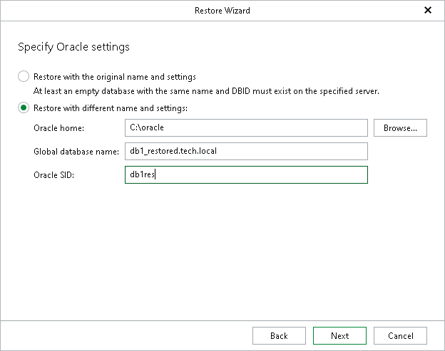

# Step 4. Specify Oracle Settings

In this article

At this step of the wizard, specify the location to which you want to restore the database.

* Select Restore with the original name and settings to restore data using the original name and settings.
* Select Restore with different name and settings to choose custom settings:

1. In the Oracle home field, specify the Oracle home directory.

You can click Browse to select a folder.

1. In the Global database name field, specify the global database name as DB\_NAME.DB\_DOMAIN, where:

* DB\_NAME is the database name. Oracle limits the length of the database name to 8 characters. If the database name you specify exceeds this limit, Veeam Explorer for Oracle will automatically shorten the database name, and hence the global database name, during the restore process.

The value you specify is also used for the unique database name (DB\_UNIQUE\_NAME). The unique database name can contain up to 30 characters.

* DB\_DOMAIN is the domain name of the database. It does not count towards any character limits and Veeam Explorer for Oracle does not shorten it during the restore process.

For example, if you specify the global database name as orcl\_restored.tech.local, Veeam Explorer for Oracle will shorten it to orcl\_res.tech.local. The database name will be orcl\_res, while the unique database name will be orcl\_restored.

The Global database name field is available only if you have selected the Recover database to specific point in time option at the [Specify Recovery Type](rman_recovery_type.md) step.

1. In the Oracle SID field, specify the database system identifier. The Oracle SID field is automatically filled with the value entered in the Global database name field, but you can also assign a different value.

The maximum length of the Oracle SID is 12 characters and it can only contain alphanumeric characters (a-z, A-Z and 0-9).

|  |
| --- |
| Note |
| Consider the following:   * To use the Restore with different name and settings option, make sure that Controlfile Autobackup is enabled. For more information, see [Oracle Environment Planning](oracle_environment_planning.md#abname). * An existing Oracle SID (if any) will be replaced with that from the backup when selecting the Restore with different name and settings option. |

Page updated 11/3/2025

Page content applies to build 13.0.1.1071
