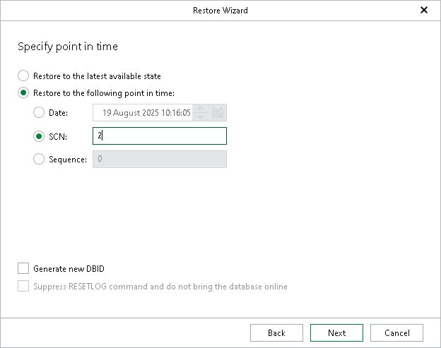

# Step 7. Specify Point in Time

In this article

At this step of the wizard, do the following:

* Select the Restore to the latest available state option to restore data as of the latest available state.
* Select the Restore to the following point in time option to select a state as of which you want to restore data:

* Select the Date option to specify the date and time of the required state.
* Select the SCN option to specify the SCN (System Change Number) of the required state.
* Select the Sequence option to specify the log sequence number of the required state.

* Select the Generate new DBID check box to generate a new DBID in addition to the new database name.

This check box is available only when using the Restore with different name and settings option at the [Specify Oracle Settings](rman_oracle_settings.md) step.

* Select the Suppress RESETLOG command and do not bring the database online check box to skip the OPEN RESETLOGS operation if it was required by the database. The database in this case remains in the mount state.

This check box is available only when using the Restore with the original name and settings option at the [Specify Oracle Settings](rman_oracle_settings.md) step.

|  |
| --- |
| Tip |
| For more information about RMAN point-in-time restore settings, see the [Oracle documentation](https://docs.oracle.com/en/database/oracle/oracle-database/21/bradv/rman-performing-flashback-dbpitr.html#GUID-7572C8E9-05B8-4BCC-823F-BD6763C51B11). |

Page updated 8/19/2025

Page content applies to build 13.0.1.1071
