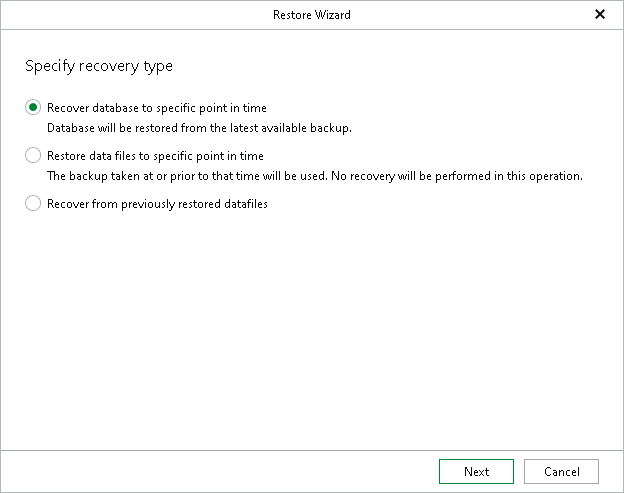

# Step 2. Specify Recovery Type

In this article

At this step of the wizard, select a recovery type:

* Recover database to specific point in time

Select this option to restore databases as of the latest available state.

* Restore data files to specific point in time

Select this option to restore only datafiles as of the specific point-in-time state without applying log files.

* Recover from previously restored datafiles

Select this option to apply log files to restored datafiles.

Page updated 8/19/2025

Page content applies to build 13.0.1.1071
