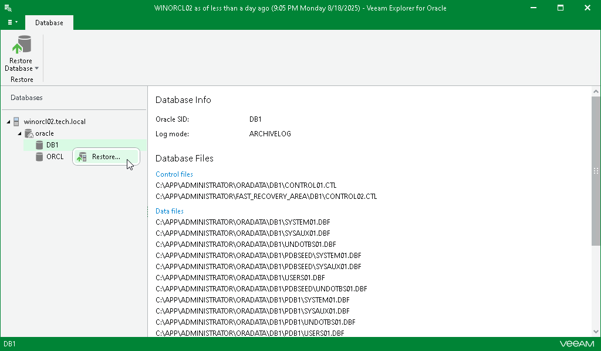

# Step 1. Launch Restore Wizard

To launch the Restore wizard, do the following:

1. Open an RMAN plug-in backup, as described in [Exploring RMAN Plug-in Backups](veor_exploring_rman.md).
2. In the navigation pane, select a database.
3. On the Database tab, select Restore Database > Restore or right-click a database and select Restore.

