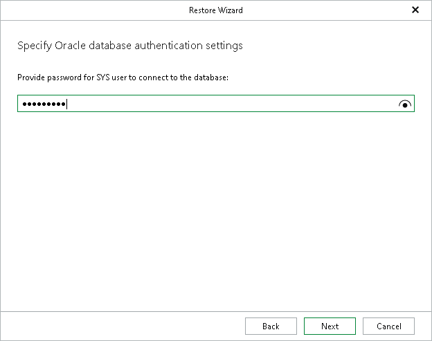

# Step 6. Specify SYS User Password

In this article

This step of the wizard is available if OS authentication to Oracle databases is disabled on the target server.

At this step of the wizard, enter the password for the SYS user of the database.

Page updated 9/26/2025

Page content applies to build 13.0.1.1071
