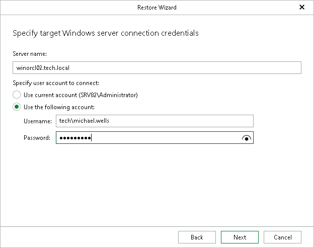
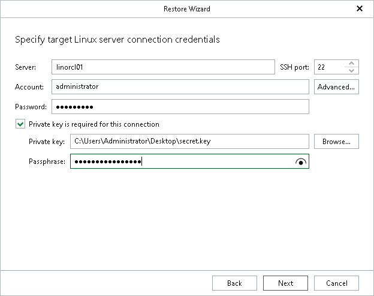

# Step 3. Specify Target Server

In this article

At this step of the wizard, specify connection settings required to access the target Oracle server. The set of connection settings depends on the OS type of the target server: Windows or Linux.

If you restore to another server, make sure that Veeam Plug-In for Oracle RMAN on the target server is properly configured. For more information, see [Considerations and Limitations](veor_considerations.md#restore-rman).

Windows-Based Oracle Server

For a Windows-based Oracle server, do the following:

1. In the Server name field, specify the DNS name or IP address of the Oracle server to which you want to restore data. When you restore Real Application Cluster (RAC) databases, the default value is the Single Client Access Name (SCAN) of the cluster.
2. In the Specify user account to connect section, select either of the following options:

* Use current account

Select this option to connect to the specified server using the current user account under which Veeam Explorer for Oracle is running.

You cannot use this option if Veeam Explorer for Oracle and the mount server are located on separate machines.

* Use the following account

Select this option to connect to the specified server using a custom user account.

For more information on the required user account settings, see the [Permissions](veo_permissions.md) section.

Linux-Based Oracle Server

For a Linux-based Oracle server, do the following:

1. In the Server field, specify the DNS name or IP address of the target Oracle server. When you restore Real Application Cluster (RAC) databases, the default value is the Single Client Access Name (SCAN) of the cluster.
2. In the SSH port field, specify the port number of the selected Oracle server.
3. In the Account field, specify an account under which to connect to the specified server. For more information on the required user account configuration, see the [Permissions](veo_permissions.md) section.
4. In the Password field, enter the password.
5. If a private key is required to connect to the selected server, do the following:

1. Select the Private key is required for this connection check box.
2. In the Private key field, specify a key.

To select a key, click Browse and select a key.

1. In the Passphrase field, enter the passphrase.

Page updated 9/26/2025

Page content applies to build 13.0.1.1071
