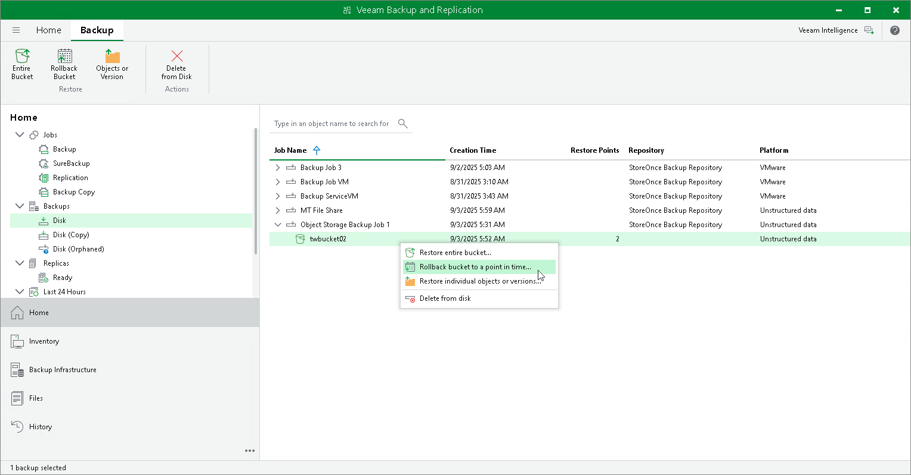

# Step 1. Launch Bucket Rollback to a Point in Time Wizard

In this article

To launch the Bucket Rollback to a Point in Time wizard, do one of the following:

* In the Home tab on the ribbon, click Restore > Object Storage. In the Restore from Object Storage Backup window, click Rollback buckets to a point in time.
* Open the Home view. In the inventory pane, select Backups. In the working area, expand the necessary backup and do one of the following:

* Click the bucket or container that you want to restore. In the Backup tab on the ribbon, click Rollback Bucket.
* Right-click the object storage that you want to restore and select Rollback bucket to a point in time.

You can roll back the bucket or container to the state as of a specific restore point by using a backup copy. Backup copies created in the secondary repositories are represented in the Backups > Disk (Copy) node in the inventory pane. If the secondary repository is an object storage repository, backup copies created in it are represented in the Backups > Object Storage (Copy) node in the inventory pane.

Page updated 9/3/2025

Page content applies to build 13.0.1.1071
