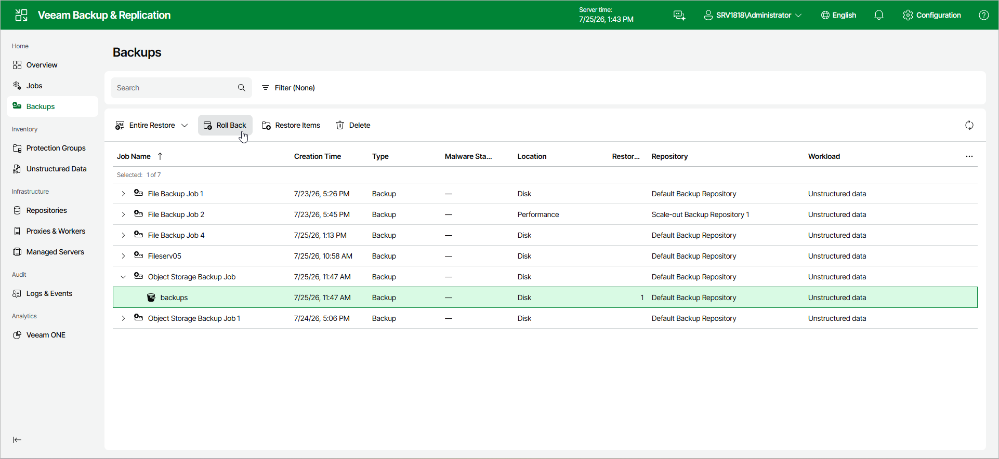

# Step 1. Launch Bucket Rollback to a Point in Time Wizard

To launch the Rollback Entire Object Storage wizard, do the following:

1. In the management pane, click the Backups node.
2. In the working area, expand the necessary backup.
3. Click Roll Back on the ribbon.

Alternatively, right-click the bucket that you want to restore and select Roll Back from the drop-down list.

Page updated 2026-07-27

