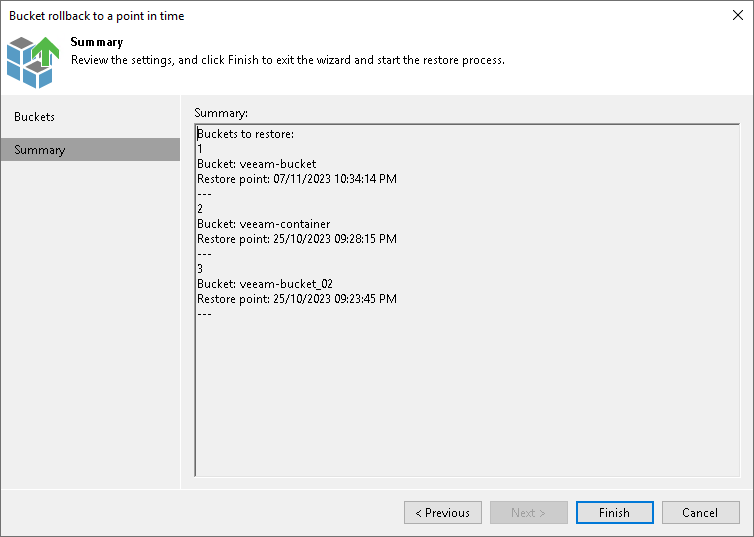

# Step 3. Finish Working with Wizard

In this article

At the Summary step of the wizard, review the bucket or container rollback settings and click Finish. Veeam Backup & Replication will roll back the bucket to the restore point.

Page updated 11/27/2023

Page content applies to build 13.0.1.1071
