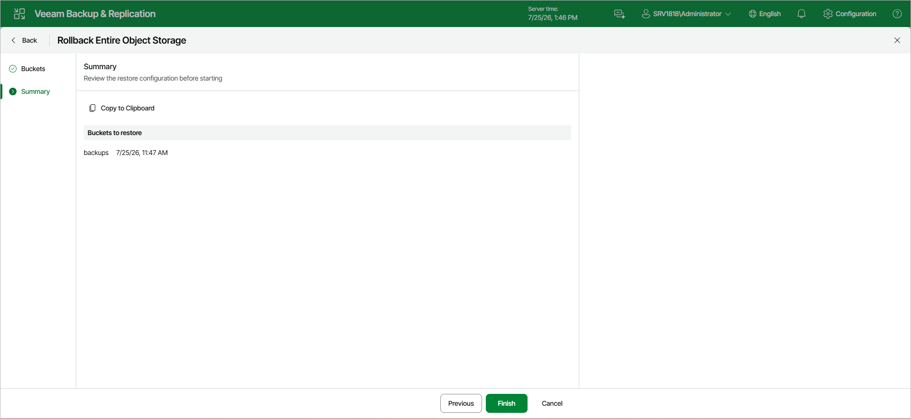

# Step 3. Finish Working with Wizard

At the Summary step of the wizard, review the bucket or container rollback settings and click Finish. Veeam Backup & Replication will roll back the bucket to the restore point.

Page updated 2026-07-25

