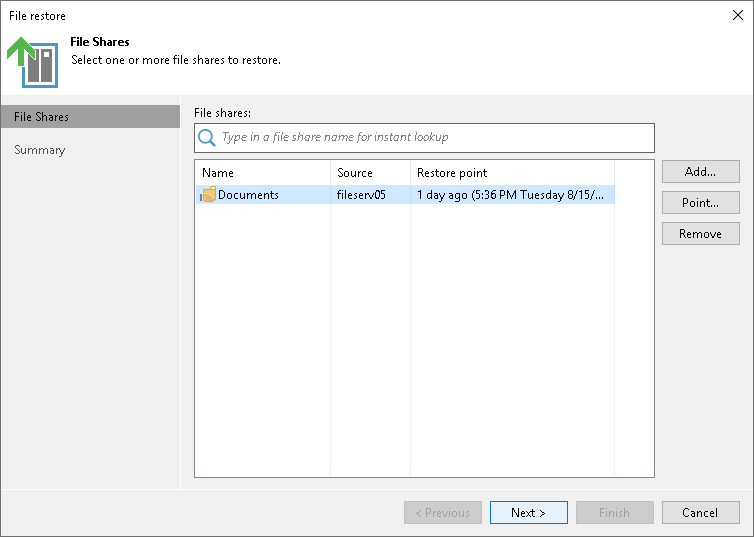

# Step 2. Select Object to Restore

In this article

At the File Shares step of the wizard, select the file share you want to roll back:

1. Click Add.
2. In the Backups Browser window, select the file backup job and then choose the file share you want to roll back. Click OK.
3. In the File shares table, choose the file share to select a restore point to roll back to. Click Point.
4. In the Select Restore Point window, select the restore point to which you want to roll back the files. To select the required restore point, do one of the following:

* Use the Restore point slider.
* Click the date link under the Restore point slider. In the calendar in the right pane of the Restore points window, select the date when the required restore point was created. The list of restore points on the left pane displays restore points created on the selected date. Select the point to which you want to roll back the files to.

In the Files in backup tree, you can see what folders and files are covered by the selected restore point and the date when each of them was modified.

Click OK.

To quickly find a file share, you can use the search field at the top of the window. Enter a file share name or a part of it in the search field and press [Enter].

To exclude the file share from the rollback process, select the file share in the table and click Remove.

Page updated 7/2/2024

Page content applies to build 13.0.1.1071
