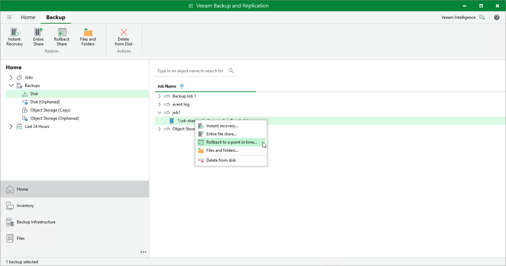

# Step 1. Launch File Restore Wizard

To launch the File Restore wizard, do one of the following:

* In the Home tab on the ribbon, click Restore > File Share. In the Restore from File Backup window, click Rollback to a point in time.
* Open the Home view. In the inventory pane, select Backups. In the working area, expand the necessary backup and do one of the following:

* Click the file share backup whose files you want to restore. In the Backup tab on the ribbon, click Rollback to a point in time.
* Right-click the file share backup whose files you want to restore and select Restore > Rollback to a point in time.

You can roll back the file share to a point in time by using a backup copy. Backup copies created in the secondary repositories are represented in the Backups > Disk (Copy) node in the inventory pane. If the secondary repository is an object storage repository, backup copies created in it are represented in the Backups > Object Storage (Copy) node in the inventory pane.

