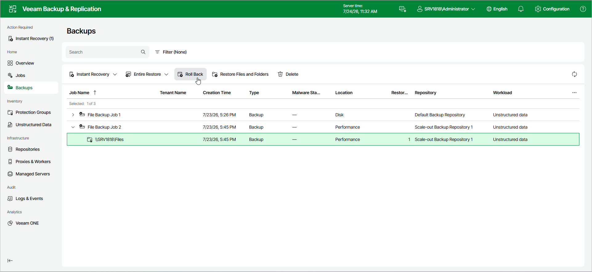

# Step 1. Launch File Restore Wizard

To launch the Rollback Entire File Share wizard, do the following:

1. In the management pane, click the Backups node.
2. In the working area, expand the necessary backup.
3. Click Roll Back on the ribbon.

Alternatively, right-click the file share that you want to roll back and select Roll Back from the drop-down menu.

Page updated 2026-07-27

