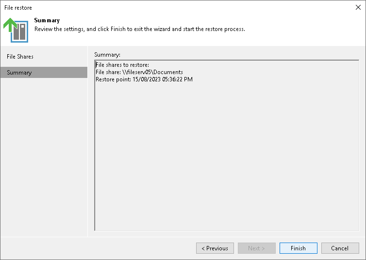

# Step 3. Finish Working with Wizard

At the Summary step of the wizard, review the file share restore settings and click Finish. Veeam Backup & Replication will restore the files to the specified point in time.

