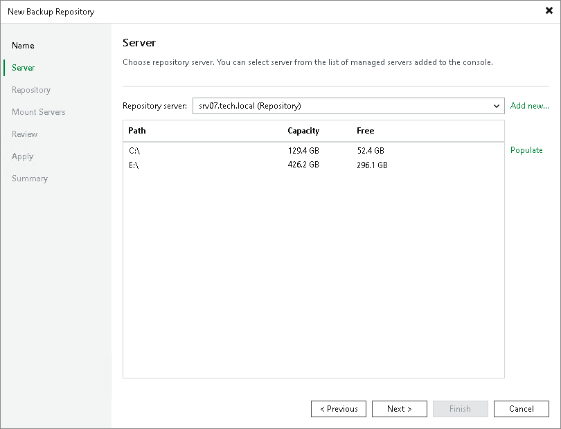
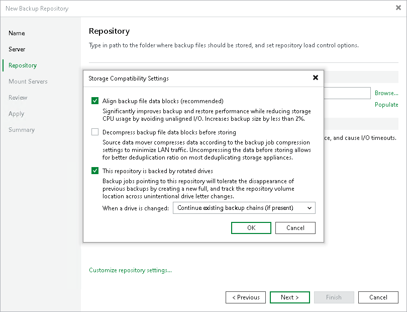

# Deploying Backup Repositories with Rotated Drives

To deploy a backup repository with rotated drives, do the following:

1. Attach one of external drives from the set to a Microsoft Windows or Linux server. The server must be added to the backup infrastructure. For more information on how to add a server, see [Virtualization Servers and Hosts](setup_add_server.md).

You can also attach the external hard drive to the backup server itself. In this case, the VM traffic will path through the backup server, which will produce additional workload on it.

1. Use the New Backup Repository wizard to add a direct attached storage. For more information, see [Adding Backup Repositories](repo_add.md). Pay attention to the following settings:

1. At the Server step of the wizard, select the server to which the drive is attached.

1. At the Repository step of the wizard, in the Path to folder field, specify a path to the folder where backup files must be stored.

|  |
| --- |
| Important |
| Later, when you attach another external hard drive to the server for the first time, this drive must have the same drive letter as specified in the Path to folder field. For more information, see [Drive Detection](rotated_drives_hiw.md#detection). |

1. Click the Customize repository settings button. In the Storage Compatibility Settings window, select the This repository is backed by rotated hard drives check box and choose how Veeam Backup & Replication will behave when a drive is swapped:

* Continue an existing backup chains if present. Select this option to continue the backup chain found on the drive.

* Delete backups belonging to this job. Select this option to delete all backups created by the currently running job.

* Delete all backups. Select this option to delete all backups created by Veeam Backup & Replication and stored on the drive in the repository folder. Note that Veeam Backup & Replication will delete all backups, even backups created by other jobs.

1. Configure other settings of the backup repository as required and finish working with the wizard.

