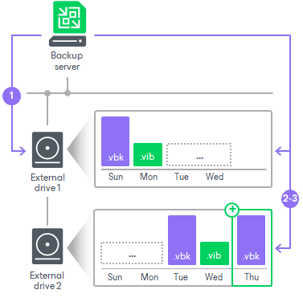
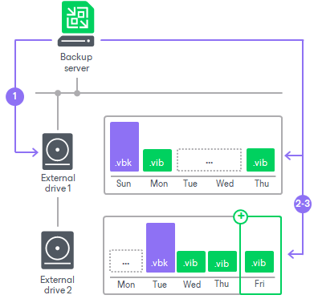
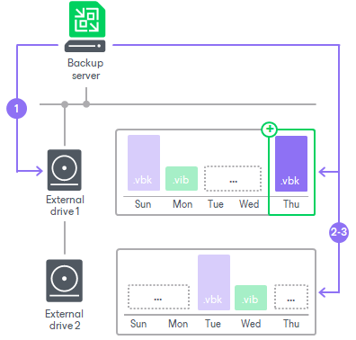

# How Repository with Rotated Drives Works

You can use [Microsoft Windows server](#MSserver) or [Linux server or SMB (CIFS) share](#LinuxSMB) as a backup repository with rotated drives.

Microsoft Windows Backup Repository

Veeam Backup & Replication performs backup jobs and backup copy jobs targeted at a backup repository with rotated drives in different ways.

|  |
| --- |
| Important |
| When you specify retention settings for a backup job or a backup copy job targeted at a backup repository with rotated drives, you must define the total number of days for how long you want to retain the restore points on one drive. For example, if you set retention to 10 days, Veeam Backup & Replication keeps the restore points created during the last 10 days on each drive in the set. |

Backup Jobs

Backup jobs are performed in the following way:

1. During the first and subsequent runs of the job, Veeam Backup & Replication creates a regular backup chain on the currently attached drive.
2. When the drives are swapped, the behavior depends on how you [have configured the repository](rotated_drives_configure.md):

* If you have chosen to continue an existing backup chain, Veeam Backup & Replication creates a new full backup file on the drive. This full backup is used as a starting point for subsequent incremental backups until the drives are swapped again.
* If you have chosen to delete the backups existing on the drive (all backups or backups created by a specific job), Veeam Backup & Replication deletes the existing backup chains. Then Veeam Backup & Replication starts the backup chain anew.

1. [For external drives attached to Microsoft Windows servers] Veeam Backup & Replication checks the retention policy set for the job. If some backup files in the backup chain are outdated, Veeam Backup & Replication removes them from the backup chain.

Backup Copy Jobs

Backup copy jobs are performed in the following way:

1. During the first and subsequent runs of the job, Veeam Backup & Replication creates a regular backup chain on the currently attached drive.
2. When the drives are swapped, the behavior depends on how you [have configured the repository](rotated_drives_configure.md):

* If you have chosen to continue an existing backup chain, the following applies:

* If the attached drive is empty, Veeam Backup & Replication creates a full backup on it.

* If there is a full backup or a backup chain on the drive, Veeam Backup & Replication creates a new incremental backup and adds it to the backup chain. The latest incremental backup existing in the backup chain is used as a starting point for the new incremental backup. If the existing backup chain is not consistent, Veeam Backup & Replication starts the backup chain anew. It creates a new full backup file on the drive, and this full backup is used as a starting point for subsequent incremental backups.

* If you have chosen to delete the backups existing on the drive (all backups or backups created by a specific job), Veeam Backup & Replication deletes the existing backup chains. Then Veeam Backup & Replication starts the backup chain anew.

1. [For external drives attached to Microsoft Windows servers] Veeam Backup & Replication checks the retention policy set for the job. If some backup files in the backup chain are outdated, Veeam Backup & Replication removes them from the backup chain.

Drive Detection

Drive letters for external drives may change when you add new volumes or storage hardware such as CD-ROM on the server. In Microsoft Windows-based backup repositories, Veeam Backup & Replication can keep track of drives and detect them even if the drive letter changes.

To detect a drive correctly, Veeam Backup & Replication must have a record about it in the configuration database. Consider the following requirements:

* When you insert a drive for the first time, the drive is not registered in the configuration database. Such drive must have the same letter as the one specified in the Path to folder field in backup repository settings. For more information, see [Configuring Path and Load Control Settings](repository_repository.md).

If the drive has some other letter, Veeam Backup & Replication will not be able to detect and use it.

* When you insert a drive that has already been used and has some restore points on it, the drive is already registered in the configuration database. Veeam Backup & Replication will be able to detect and use it, even if the drive letter changes.
* If the drive letter of the already used drive changes and a job has not run yet, you cannot change the [option that controls the behavior when rotated drives are swapped](rotated_drives_configure.md). To change the behavior, change the drive letter back to the original one and change the option that controls the behavior, then change the drive letter as required.

Linux and Shared Folder Backup Repository

If you use a Linux server or SMB (CIFS) share as a backup repository with rotated drives, Veeam Backup & Replication employs a “cropped” mechanism of retention with rotated drives. Veeam Backup & Replication keeps information only about the latest backup chain in the configuration database. Information about previous backup chains is removed from the database. For this reason, the retention policy set for the job may not work as expected.

1. During the first and subsequent runs of the job, Veeam Backup & Replication creates a regular backup chain on the currently attached drive.
2. When the drives are swapped, the behavior depends on how you [have configured the repository](rotated_drives_configure.md):

* If you have chosen to continue an existing backup chain, Veeam Backup & Replication creates a new full backup file on the drive. This full backup is used as a starting point for subsequent incremental backups until the drives are swapped again.
* If you have chosen to delete the backups existing on the drive (all backups or backups created by a specific job), Veeam Backup & Replication deletes the existing backup chains. Then Veeam Backup & Replication starts the backup chain anew.

Veeam Backup & Replication starts a new backup chain on the drive. It removes the information from the configuration database about the restore points from previous backup chains. Backup files related to these previous restore points are not deleted, they remain on disk. This happens because Veeam Backup & Replication applies the retention policy only to the current backup chain, not to previous backup chains.

