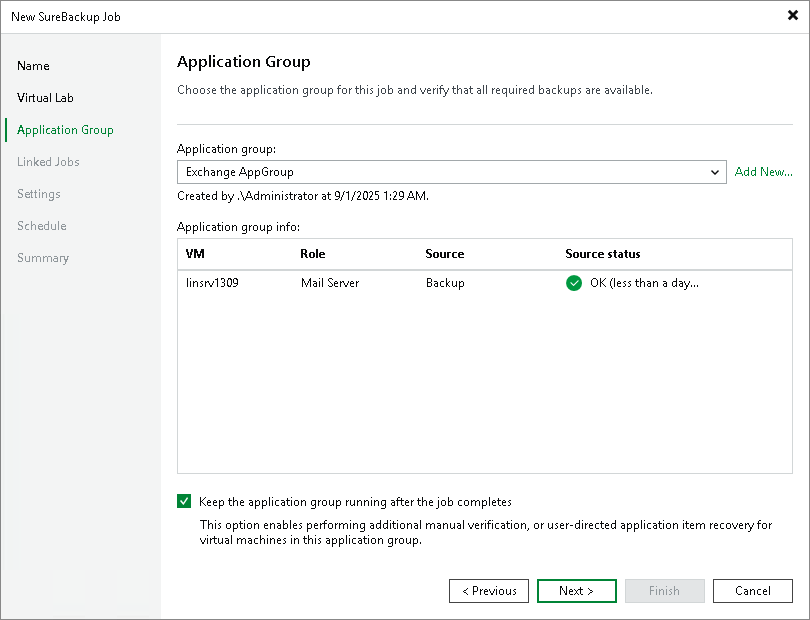
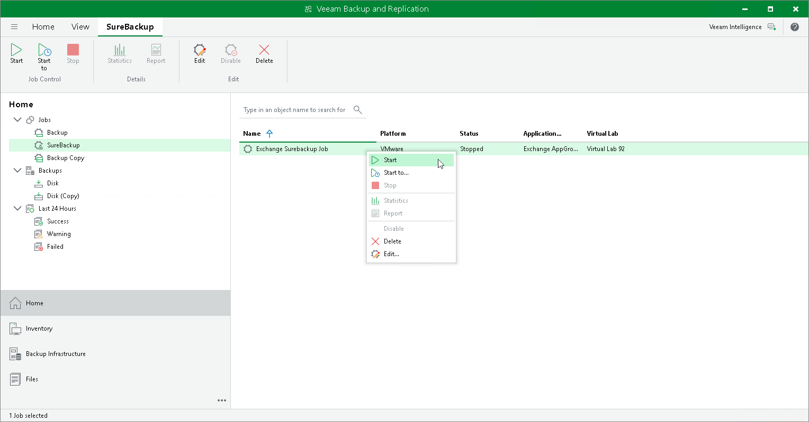

# Configuring On-Demand Sandbox

To configure the On-Demand Sandbox, perform the following steps:

1. Configure a virtual lab in which you plan to start VMs. For more information, see [Creating Virtual Lab](create_vlab.md).
2. Configure an application group. The application group must contain all VMs that you plan to start in the On-Demand Sandbox and all VMs on which these VMs are dependent. For more information, see [Creating Application Groups](appgroup_create.md).
3. Configure a SureBackup job:

1. Launch the New SureBackup Job wizard.
2. At the Virtual Lab step of the wizard, select the configured virtual lab.
3. At the Application Group step of the wizard, select the configured application group.
4. Select the Keep the application group running after the job completes check box.
5. Configure other job settings as required and save the job settings.

To start VMs in the On-Demand Sandbox, run the SureBackup job:

1. Open the Home view.

1. In the inventory pane, select SureBackup.
2. In the working area, right-click the configured SureBackup job and select Start or Start to.

Veeam Backup & Replication will start the virtual lab and power on VMs from the application group in the virtual lab. You will be able to connect to VMs and perform tests for them.

