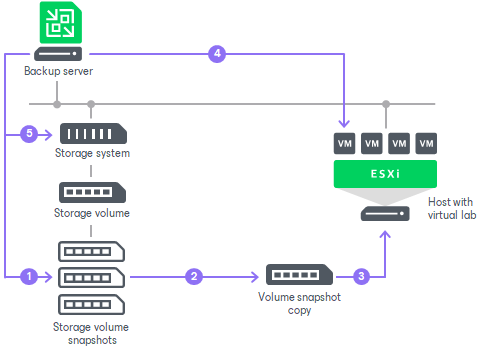

# On-Demand Sandbox for Storage Snapshots

In On-Demand Sandbox, you can start VMs from snapshots existing on the production storage array. You can use On-Demand Sandbox to test VMs, troubleshoot issues, perform training and so on.

On-Demand Sandbox configuration where VMs from storage snapshots are started is similar to configuration of the regular On-Demand Sandbox. To start a VM from the storage snapshot in the isolated environment, you must configure the following objects:

* Virtual lab. The virtual lab must mirror the networking scheme of the production environment. You can configure a new virtual lab or use an existing virtual lab. Any type of the virtual lab configuration is supported: basic single-host, advanced single-host or advanced multi-host. For more information, see [Virtual Lab](https://helpcenter.veeam.com/docs/backup/vsphere/virtual_lab.html?ver=120) in the Veeam Backup & Replication User Guide.
* Application group. The application group must contain one or several VMs that you want to start in the On-Demand Sandbox. You can select VMs from volumes or LUNs on the storage system. During the SureBackup job, Veeam Backup & Replication will detect the latest snapshot for this volume or LUN and start the VM from this snapshot. For more information, see [Application Group](https://helpcenter.veeam.com/docs/backup/vsphere/application_group.html?ver=120) in the Veeam Backup & Replication User Guide.
* SureBackup job. You must link the application group with VMs and virtual lab to the SureBackup job. For more information, see [SureBackup Job](https://helpcenter.veeam.com/docs/backup/vsphere/surebackup_job.html?ver=120). in the Veeam Backup & Replication User Guide.

How On-Demand Sandbox for Storage Snapshots Works

To start a VM from a storage snapshot in On-Demand Sandbox, Veeam Backup & Replication needs to present this storage snapshot to an ESXi host as a datastore. To do this, Veeam Backup & Replication performs the following actions:

1. Veeam Backup & Replication detects the latest storage snapshot for the VM whose disks are located on the storage system.
2. Veeam Backup & Replication triggers the storage system to create a copy of the storage snapshot. The snapshot copy helps protect the storage snapshot from changes.

To create a snapshot copy, Veeam Backup & Replication uses the same technology as for Data Recovery from Storage Snapshots. For more information, see [Data Recovery from Storage Snapshots](https://helpcenter.veeam.com/docs/backup/storage/storage_snapshots_restore.html?ver=120).

1. The snapshot copy is presented as a new datastore to the ESXi host on which the virtual lab is registered.
2. Veeam Backup & Replication performs regular operations required for On-Demand Sandbox: reconfigures the VMX file, starts the VM, performs necessary tests for it and so on.
3. After you finish working with VMs and power off On-Demand Sandbox, Veeam Backup & Replication performs cleanup operations: powers off the VM and the proxy appliance in the virtual lab, unmounts the datastore from the ESXi host and triggers the storage system to remove the snapshot copy.

Number of Mounted NFS Datastores

You can add to the application group several VMs that reside on different storage snapshots. In this case, Veeam Backup & Replication will trigger several snapshot copies (one per each storage snapshot) and present the equal number of datastores to the ESXi host.

The number of NFS datastores that can be mounted to the ESXi host is limited by VMware vSphere. If number of snapshot copies is great, Veeam Backup & Replication may fail to present all of them as datastores to the ESXi host. In this case, VMs in the application group will not be started and the SureBackup job will fail. For more information about limitations, see this [VMware KB article](https://kb.vmware.com/s/article/2239).

To overcome this situation, Veeam Backup & Replication offers the mechanism of the snapshot copy re-mounting:

1. If Veeam Backup & Replication detects that there are not enough resources to mount a datastore, it displays a warning and offers you to free up resources on the ESXi host.
2. During the next 20 minutes, Veeam Backup & Replication attempts to mount the datastore with the time interval of 2 minutes.
3. If resources are freed and Veeam Backup & Replication manages to mount the datastore, VMs in the application group are started and the SureBackup job continues to run. If resources on the ESXi hosts are not freed within 20 minutes, the SureBackup job fails.

