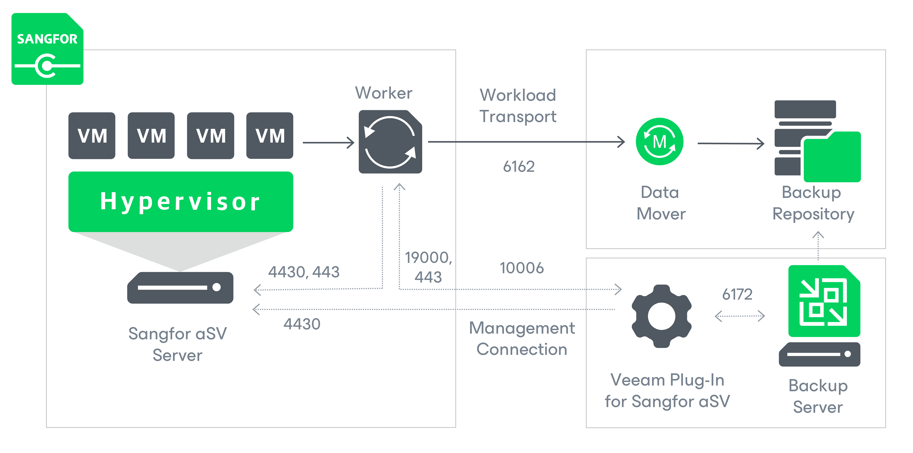

# Solution Architecture

Since Veeam Plug-in for Sangfor aSV is integrated with Veeam Backup & Replication, the solution architecture comprises the following set of components:

* [Sangfor Cloud Platform](sangfor_infrastructure_components.md#scp)
* [Sangfor aSV clusters](sangfor_infrastructure_components.md#cluster)
* [Backup server](#server)
* [Veeam Plug-in for Sangfor aSV](#plugin)
* [Backup repositories](#repositories)
* [Workers](#workers)

Sangfor Cloud Platform

The Sangfor Cloud Platform is a software appliance that provides a centralized interface for managing multiple clusters in the Sangfor hyper-converged infrastructure (HCI) environment. Veeam Plug-in for Sangfor aSV uses the Sangfor Cloud Platform to access all the registered clusters.

Sangfor aSV Cluster

A Sangfor aSV cluster is a logical group of Sangfor HCI nodes managed by Sangfor Cloud Platform. Veeam Plug-in for Sangfor aSV uses the cluster to access such Sangfor aSV resources as storage, networks and VMs while performing backup and restore operations.

Backup Server

A backup server is either a Windows-based or Linux-based physical or virtual machine on which Veeam Backup & Replication is installed. The backup server is the configuration, administration and management core of the backup infrastructure. It coordinates backup and restore operations, controls job scheduling and manages resource allocation.

Veeam Plug-In for Sangfor aSV

Veeam Plug-in for Sangfor aSV is an architecture component that enables integration between the backup server and other components of the backup infrastructure. Veeam Plug-in for Sangfor aSV allows Veeam Backup & Replication to connect to the Sangfor aSV server, and to perform data protection and disaster recovery tasks with Sangfor aSV resources.

Backup Repositories

A backup repository is a storage location where Veeam Backup & Replication stores backups of protected Sangfor aSV VMs.

To communicate with backup repositories, Veeam Backup & Replication uses Veeam Data Mover — the service that is responsible for data processing and transfer. By default, Veeam Data Mover runs on the repositories themselves. If a repository cannot host Veeam Data Mover, it starts on a gateway server — a dedicated component that “bridges” the backup server and workers. For more information, see [Gateway Servers](gateway_server.md).

Workers

A worker is a Linux-based VM that resides on the Sangfor aSV host and processes backup workloads when transferring data to and from backup repositories.

Page updated 2026-07-15

