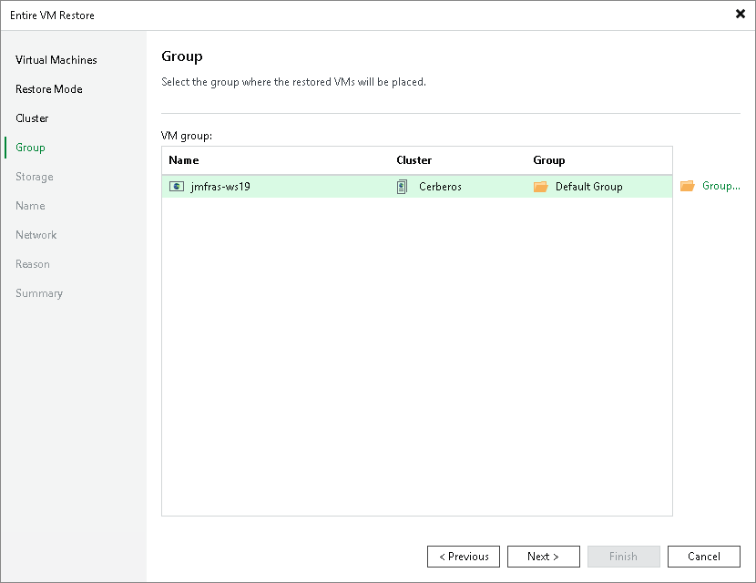

# Step 5. Select Target Group

[This step applies only if you have selected the Restore to a new location, or with different settings option at the Restore Mode step of the wizard]

At the Group step of the wizard, select a group to which the recovered VM will belong.

Page updated 2026-07-14

