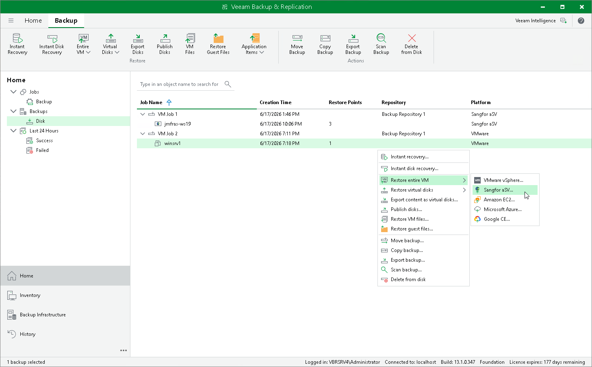

# Step 1. Launch Entire VM Restore Wizard

To launch the Entire VM Restore wizard, do the following:

1. In the Veeam Backup & Replication console, open the Home view.
2. In the inventory pane, select Backups.

1. In the working area, expand the necessary backup job, right-click the VM you want to restore and select Restore entire VM > Sangfor aSV.

Alternatively, expand the necessary backup job, select the VM and click Entire VM > Sangfor aSV on the ribbon.

Page updated 2026-04-14

