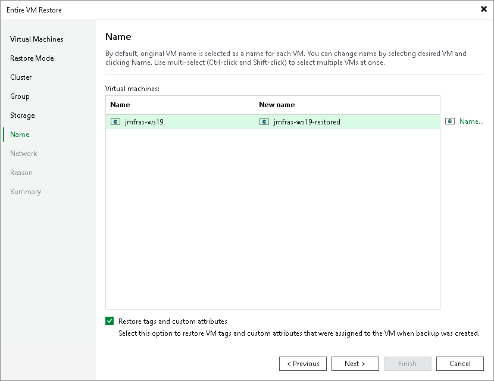

# Step 7. Specify VM Name

[This step applies only if you have selected the Restore to a new location, or with different settings option at the Restore Mode step of the wizard]

At the Name step of the wizard, you can specify a new name for the recovered VM. The maximum length of the name is 70 bytes; the following characters are supported:

* a-z A-Z 0-9
* Special characters:（）【】\_-.+()@
* Chinese characters
* Space

|  |
| --- |
| Tip |
| You can also choose whether you want the recovered VM to be included into the same tags with the same attributes as the original VM. |

Page updated 2026-07-16

