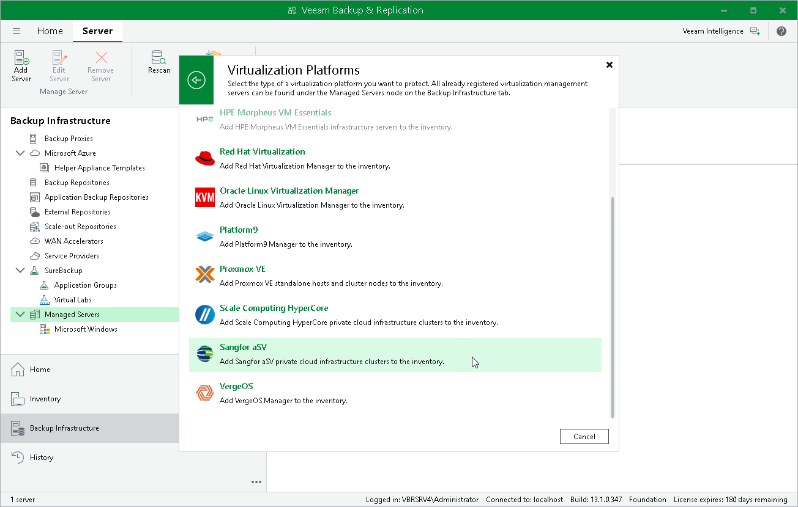

# Step 1. Launch New Sangfor aSV Server Wizard

To launch the New Sangfor aSV Server wizard, do the following:

1. In the Veeam Backup & Replication console, open the Backup Infrastructure view.
2. In the inventory pane, select Managed Servers.
3. On the ribbon, click Add Server.
4. In the Add Server window, select Virtualization Platforms.

1. In the Virtualization Platforms window, select Sangfor aSV to launch the New Sangfor aSV Server wizard.

Page updated 2026-04-14

