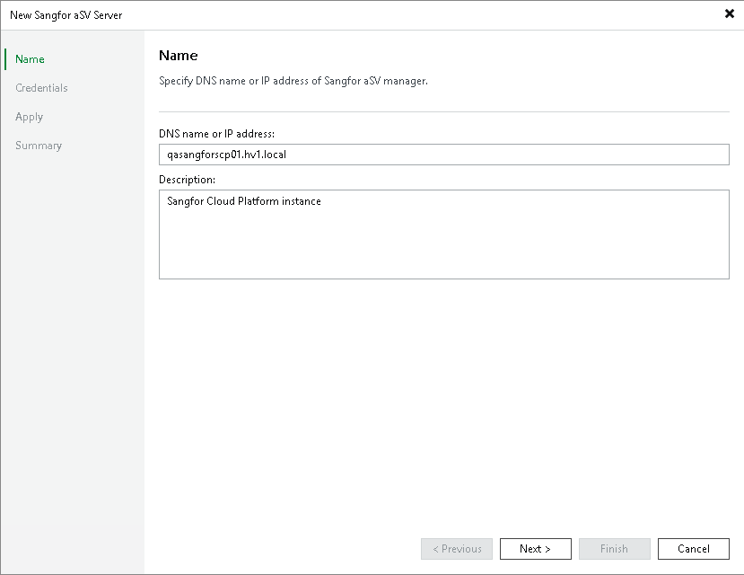

# Step 2. Specify Domain Name or IP Address of Sangfor aSV Server

At the Name step of the wizard, do the following:

1. In the DNS name or IP address field, enter the FQDN or IP address of the Sangfor Cloud Platform.
2. In the Description field, provide a description for future reference. The field already contains a default description with information about the user who added the manager, date and time when the manager was added.

Page updated 2026-05-07

