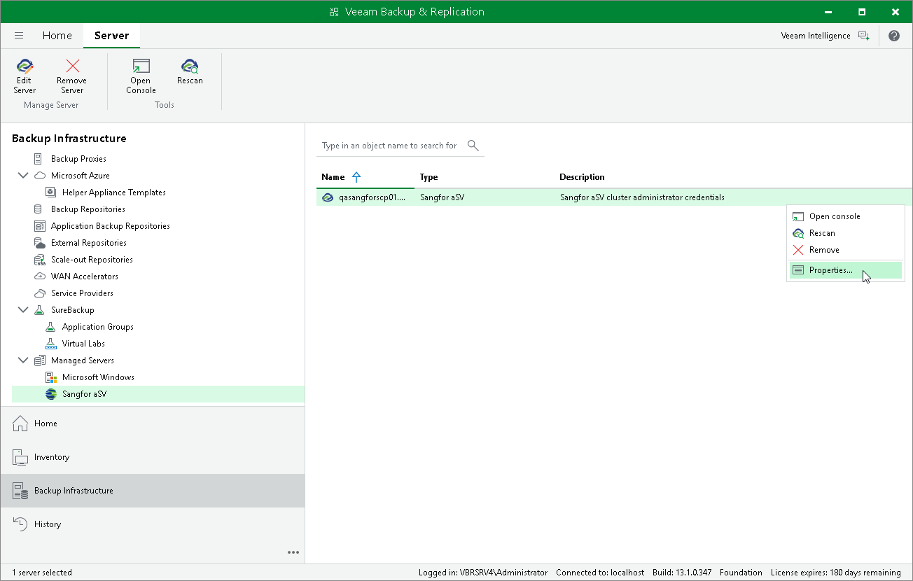

# Editing Sangfor aSV Server Properties

To edit properties of the Sangfor Cloud Platform added to the backup infrastructure, do the following:

1. Open the Backup Infrastructure view.
2. In the inventory pane, select Managed Servers > Sangfor aSV.
3. In the working area, select the Sangfor Cloud Platform and click Edit Server on the ribbon, or right-click the Sangfor Cloud Platform and select Properties.
4. Complete the Edit Sangfor aSV Server wizard as described in section [Adding Sangfor aSV server to Backup Infrastructure](sangfor_server_add.md).

Page updated 2026-05-13

