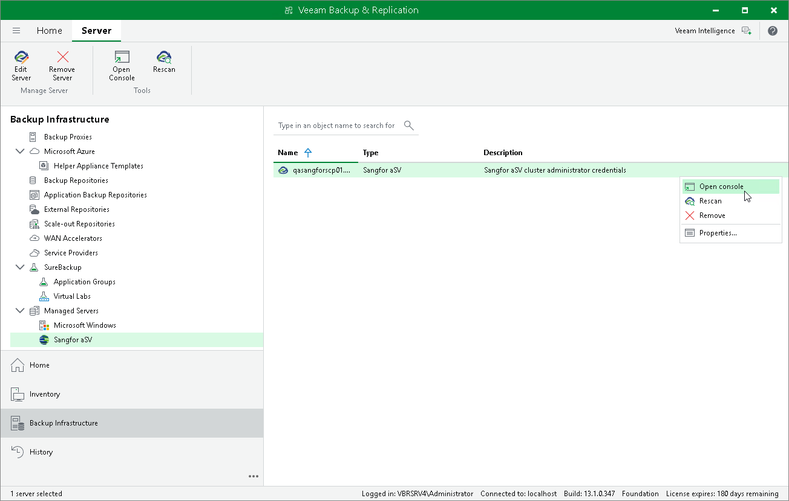

# Accessing Sangfor aSV Server Console

If you want to check the configuration of your Sangfor aSV infrastructure, you can use Veeam Backup & Replication to launch the Sangfor Cloud Platform console.

To access the Sangfor Cloud Platform console:

1. Open the Backup Infrastructure view.
2. In the inventory pane, select Managed Servers > Sangfor aSV.
3. In the working area, select the Sangfor Cloud Platform and click Open Console on the ribbon, or right-click the Sangfor Cloud Platform and select Open Console.

Page updated 2026-07-10

