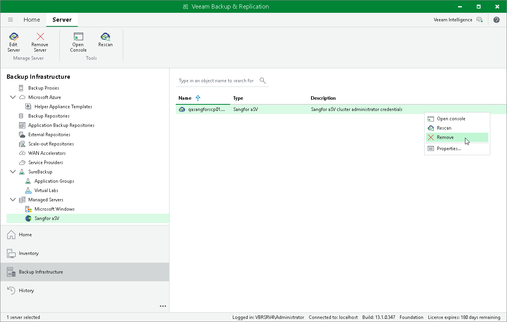

# Removing Sangfor aSV Server

If you do not want to protect resources managed by the connected Sangfor Cloud Platform anymore, you can remove it from the backup infrastructure.

To remove the Sangfor Cloud Platform from the backup infrastructure:

1. Open the Backup Infrastructure view.
2. In the inventory pane, select Managed Servers > Sangfor aSV.
3. In the working area, select the Sangfor Cloud Platform and click Remove Server on the ribbon, or right-click the Sangfor Cloud Platform and select Remove.

Page updated 2026-05-08

