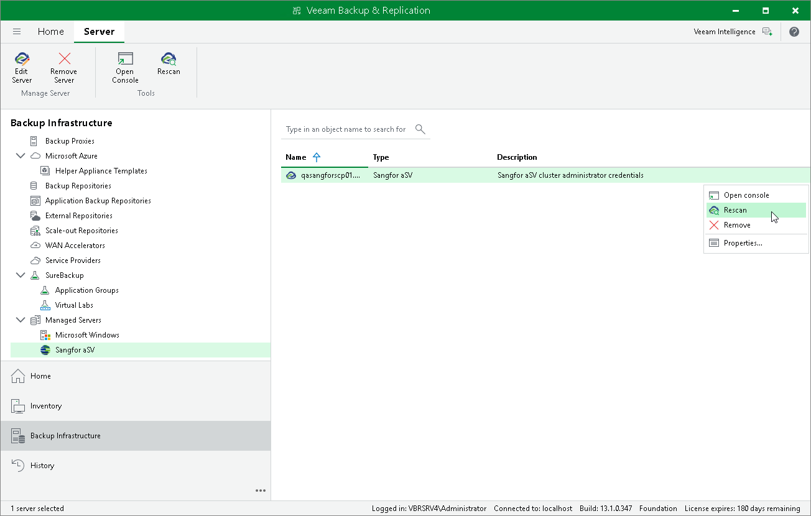

# Rescanning Sangfor aSV Server

Veeam Backup & Replication retrieves information about the Sangfor aSV environment from the Sangfor Cloud Platform. However, the data synchronization process may take some time to complete. If you make any changes to the Sangfor aSV environment and want the Veeam Backup & Replication console to display the changes immediately, you can rescan the Sangfor Cloud Platform manually.

To rescan the Sangfor Cloud Platform, do the following:

1. Open the Backup Infrastructure view.
2. In the inventory pane, select Managed Servers > Sangfor aSV.
3. In the working area, select the Sangfor Cloud Platform and click Rescan on the ribbon, or right-click the Sangfor Cloud Platform and select Rescan.

Page updated 2026-05-13

