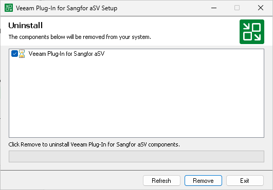

# Uninstalling Veeam Plug-In for Sangfor aSV Manually

[This section does not apply to Linux-based backup server]

|  |
| --- |
| Tip |
| Before you uninstall Veeam Plug-in for Sangfor aSV, it is recommended that you [remove the Sangfor aSV server](sangfor_server_remove.md) from the backup infrastructure. In this case, Veeam Backup & Replication will also remove workers and worker images from the connected Sangfor aSV clusters. |

To uninstall Veeam Plug-in for Sangfor aSV, do the following:

1. Log in to the backup server using an account with the Local Administrator permissions.
2. Open the Start menu and click the Settings icon.
3. In the Settings window, navigate to Apps > Installed apps.
4. In the program list, select Veeam Plug-in for Sangfor aSV. Then, click Uninstall.
5. In the opened window, click Remove.

Page updated 2026-07-16

