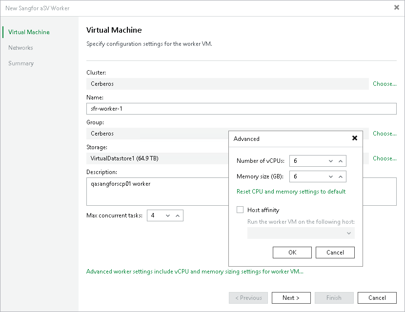

# Step 2. Specify Worker VM Settings

At the Virtual Machine step of the wizard, do the following:

1. Click Choose next to the Cluster field to specify a cluster where the worker will be launched.

Make sure that the default local storage is enabled on the selected host. If you cannot use the default storage in your environment, contact [Veeam Customer Support](sangfor_export_logs.md).

1. In the Name field, specify a name for the worker. The maximum length of the name is 63 characters; the following characters are only supported: a-z, A-Z, 0-9, -. The hyphen-minus character (-) is supported, but you cannot use it as the first or the last character of the name.
2. Click Choose next to the Group field to select a group where the worker will be launched.
3. Click Choose next to the Storage field to select a storage where system files of the worker will be stored. For storage to be displayed in the list of available storage, it must be configured in the virtual environment.

Make sure that the selected storage supports snapshots.

1. In the Worker description field, provide a description for future reference. The maximum length of the description is 1024 characters.
2. In the Max concurrent tasks field, specify the number of tasks that the worker will be able to handle in parallel. If this value is exceeded, the worker will not start processing a new task until one of the currently running tasks finishes.

The default number of concurrent tasks is set to 4. When you change this value, the wizard automatically adjusts the amount of resources that will be allocated to the worker. If you want to specify the amount of resources manually, click Advanced proxy settings.

1. To specify a host where the worker will be launched, click Advanced proxy settings, select the Host affinity check box and choose the host.

If you do not specify host affinity settings, Veeam Backup & Replication will automatically define the host to launch the worker.

Page updated 2026-07-16

