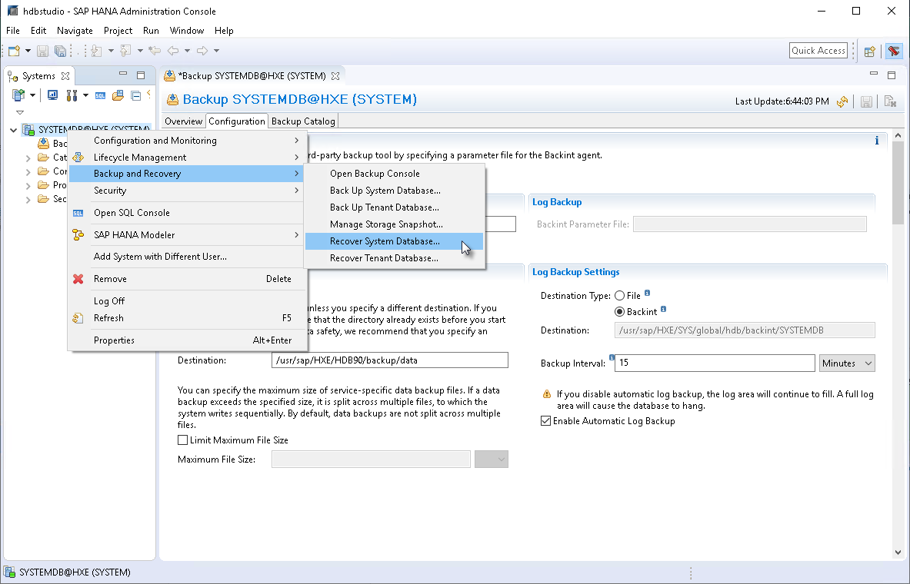
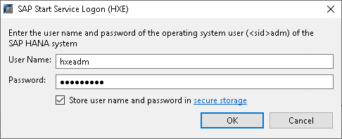
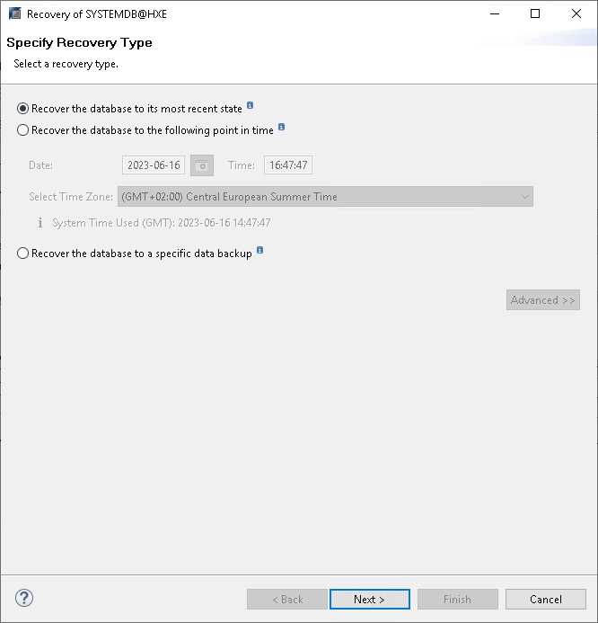
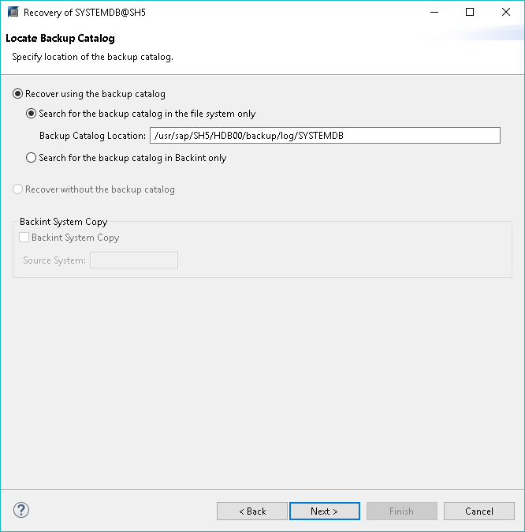
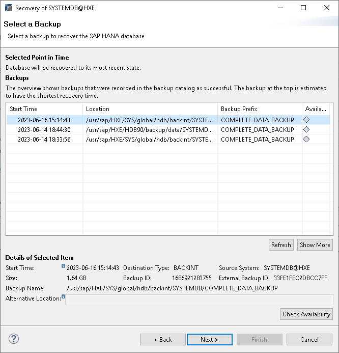
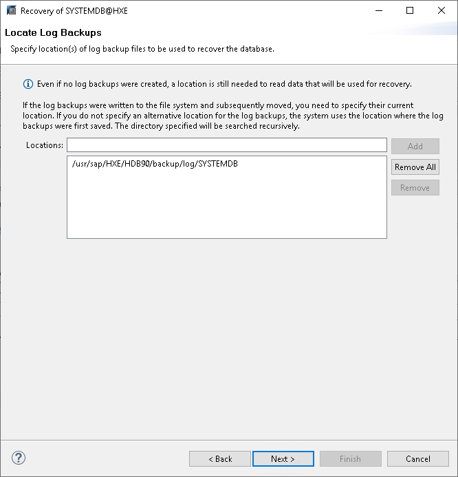
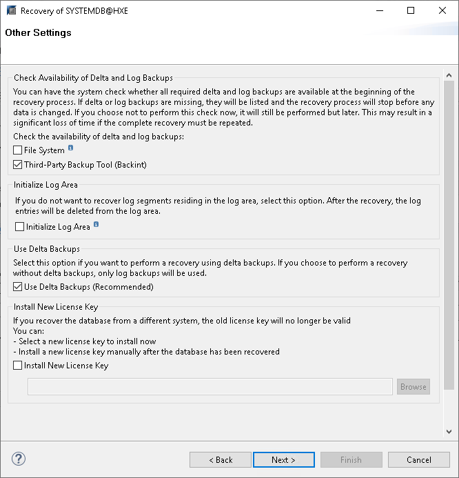
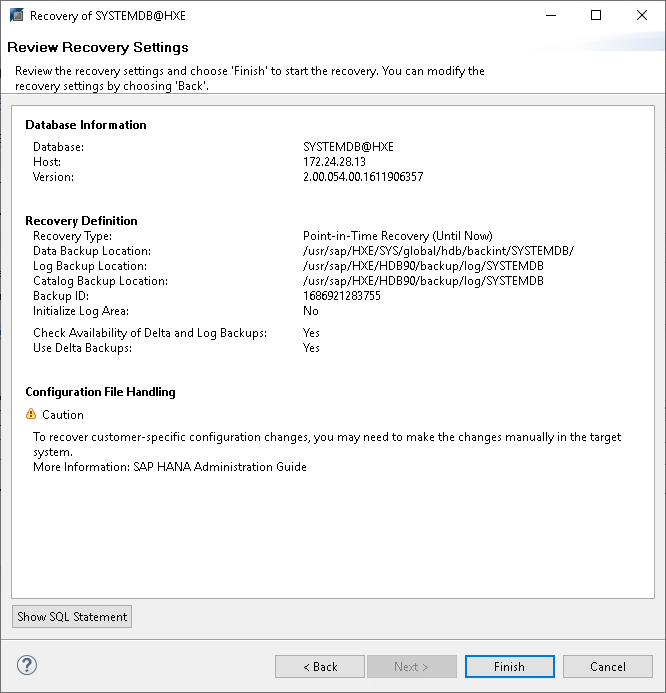

# Restoring Databases (SAP HANA Studio)

You can restore SAP HANA databases from the Veeam Plug-In backups using SAP HANA Studio.

The example below is provided for demonstration purposes only. For details on the full restore functionality of SAP HANA tools, see [this SAP article](https://help.sap.com/docs/SAP_HANA_PLATFORM/f157e7b47b2a417a99eadd4b6c433b77/839c333ac48643b2b404a3b5e9520cba.html?locale=en-US&version=2.0.06).

To perform a Backint recovery from Veeam Plug-In backups, do the following:

1. Log in to SYSTEMDB as a user with DATABASE ADMIN privileges.
2. Right-click the SYSTEMDB database.
3. Click Backup and Recovery and select Recover System Database or Recover Tenant Database.

1. Enter the operating system user credentials.

1. Recovery process requires the database to be shut down. In the pop-up window, click OK to confirm the database shutdown.

1. At the Specify Recovery Type step of the recovery wizard, select the required restore point or the option to restore the database to the most recent state.

1. At the Locate Backup Catalog step of the wizard, select one of the following options, depending on where your backup catalogs reside:

* Search for the backup catalog in the file system only
* Search for the backup catalog in Backint only

1. Select the required backup to restore.

1. At the Locate Log Backups step, click Next.

1. At the Other Settings step:

1. Switch on the availability check for the Backint backups.
2. If you are recovering the database to a database with a new SID or landscape ID, select the Install New License Key check box and specify the path to the license file.
3. Click Next.

1. At the Review Recovery Settings step, click Finish.

