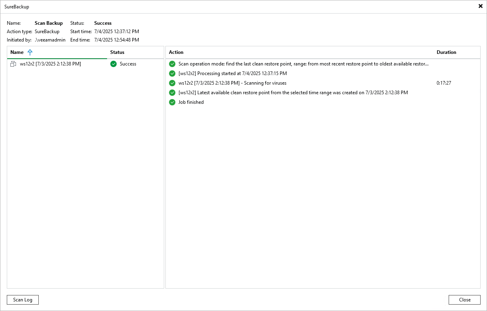

# Viewing Antivirus Scan Results

In this article

Results of the antivirus scan are available in the Scan Backup session statistics.

To view Scan Backup session statistics, do one of the following:

* Open the Home view. In the [inventory pane](vbr_ui.md), select Last 24 hours. In the working area, double-click the necessary Scan Backup session. Alternatively, you can select the session and click Statistics on the ribbon or right-click the session and select Statistics.
* Open the History view. In the [inventory pane](vbr_ui.md), select Jobs. In the working area, double-click the necessary Scan Backup session. Alternatively, you can select the session and click Statistics on the ribbon or right-click the session and select Statistics.

To view the detailed log of the scan, click Scan Log. Veeam Backup & Replication will display the most recent logs in a file of 1 MB in size.

Full logs of the scan are stored on the mount server in the C:\ProgramData\Veeam\Backup\FLRSessions\Windows\FLR\_\_<machinename>\_\Antivirus folder (for Veeam Backup & Replication on Microsoft Windows) or in the /var/log/VeeamBackup/FLRSessions/OtherOS/FLR\_<machinename>/Antivirus/ directory (for Veeam Backup & Replication on Linux).

Page updated 7/10/2025

Page content applies to build 13.0.1.1071
