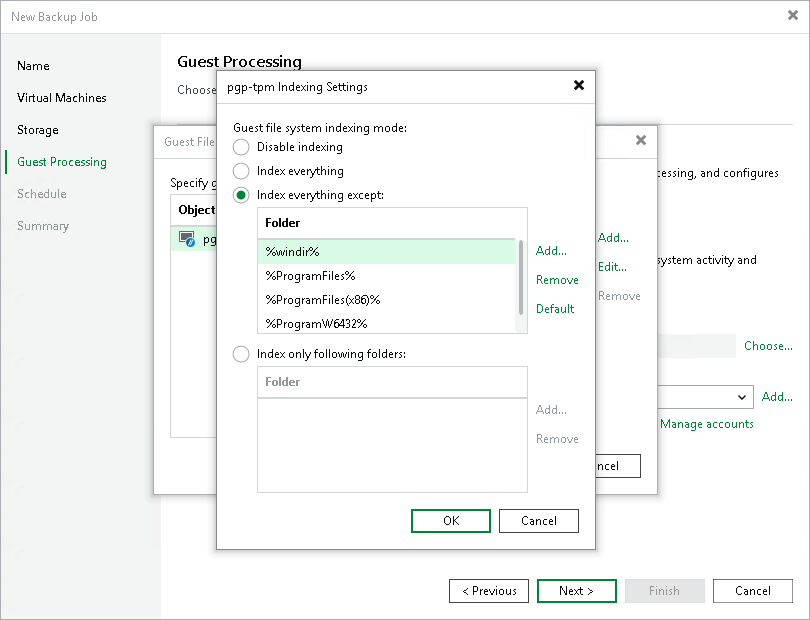

# Step 5b. Enable VM Guest OS File Indexing

To enable guest OS file indexing, select the Enable guest file system indexing and malware detection check box at the Guest Processing step of the wizard.

By default, Veeam Backup & Replication will create a catalog of all files and folders for each processed VM — except for system files. To change this behavior and configure indexing settings for a specific VM, do the following:

1. Click Customize guest file system indexing settings.
2. In the Guest File System Indexing Options window, select the necessary VM and click Edit > Windows indexing or Linux indexing. You can configure indexing settings for one or more VMs at a time.
3. In the Indexing Settings window, choose whether you want to index files in all guest OS folders, to index files only in specific folders, or not to index any files at all.

If you select the Index everything except or Index only following folders option, you will be able to modify the list of folders included into the indexing scope — either manually or by using system environment variables (for example, %windir%, %ProgramFiles% and %Temp%).

|  |
| --- |
| Important |
| To allow Veeam Backup & Replication to perform guest OS file indexing for Linux VMs, openssh, gzip and tar utilities must be installed on the processed VMs. |

