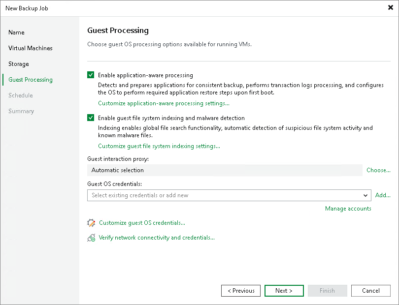

# Step 5. Specify Guest Processing Options

[This section applies only to Veeam Plug-in for Scale Computing HyperCore v3]

At the Guest Processing step of the wizard, you can specify the following settings:

* [Enable application-aware processing](sch_backup_job_create_gp_applications.md) — to create transactionally consistent backups that will guarantee proper recovery of VM applications, without data loss.

For VMs running Microsoft SQL Server, Oracle Server or PostgreSQL Server applications, you can also instruct Veeam Backup & Replication to periodically back up transaction logs. This will allow you to restore your databases to specific points in time as described in the Veeam Enterprise Manager User Guide, section [Restoring Point-in-Time State](https://helpcenter.veeam.com/docs/vbr/explorers/vesql_restoring_pit.html?ver=13).

* [Enable guest file system indexing and malware detection](sch_backup_job_create_gp_indexing.md) — to create a catalog of files located on the guest OS. The catalog allows you to browse, search and perform 1-click restores of individual files. Guest indexing data in the catalog is scanned for suspicious file system activity and malware files. For more information, see the [Preparing for File Browsing and Searching](https://helpcenter.veeam.com/docs/vbr/em/preparing_for_file_browsing.html?ver=13) section of the Enterprise Manager User Guide. For details on malware detection, see [How Guest Indexing Data Scan Works](malware_detection_guest_index_hiw.md).
* [Choose guest interaction proxies](sch_backup_job_create_gp_proxy.md) — to select specific servers that Veeam Backup & Replication will use when communicating with guest OSes of VMs included into the backup scope.
* [Manage VM guest OS credentials](sch_backup_job_create_gp_credentials.md) — to specify credentials that Veeam Backup & Replication will use to access guest OSes of all VMs included into the backup scope.

Considerations and Limitations

If you enable application-aware processing or guest files system indexing, consider the following:

* Guest processing requires Veeam Plug-in for Scale Computing HyperCore to access IP addresses of the processed VMs. To achieve that, make sure that Scale Computing Guest Tools (for Windows machines) or QEMU Guest Agent (for Linux machines) are installed on the VMs.
* Veeam Plug-in for Scale Computing HyperCore will not be able to [use Kerberos authentication](kerberos_authentication.md) while connecting to guest OSes of the processed VMs.

