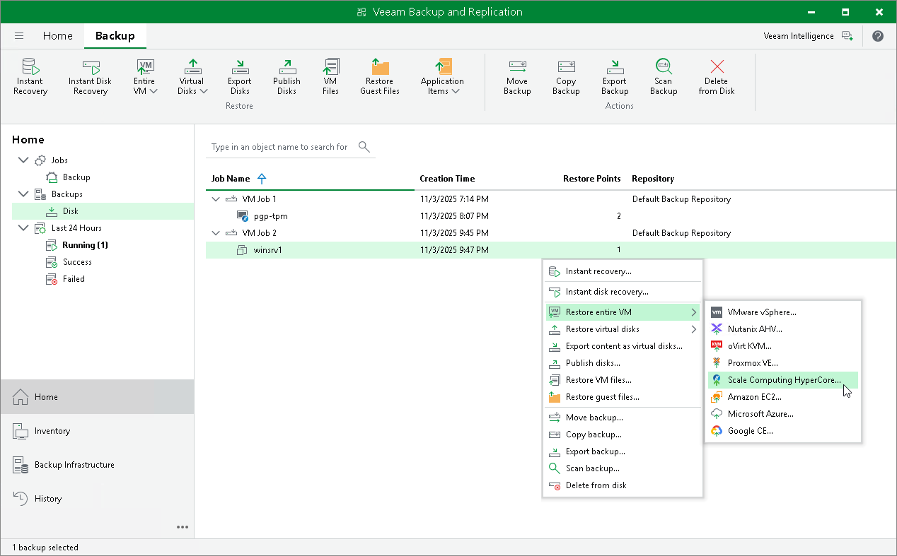

# Step 1. Launch Entire VM Restore Wizard

To launch the Entire VM Restore wizard, do the following:

1. Open the Home view.
2. In the inventory pane, select Backups.
3. In the working area, expand the necessary backup job, select the VM that you want to restore, click Entire VM on the ribbon and select Scale Computing HyperCore.

Alternatively, you can right-click the VM and select Restore entire VM > Scale Computing HyperCore.

