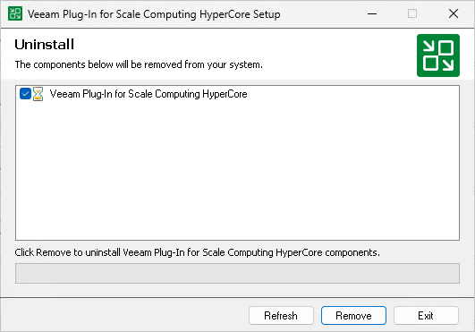

# Uninstalling Veeam Plug-in for Scale Computing HyperCore Manually

Before you uninstall Veeam Plug-in for Scale Computing HyperCore, it is recommended to [remove all configured workers](sch_workers_remove.md) from the backup infrastructure.

To uninstall Veeam Plug-in for Proxmox VE, do the following:

1. Log in to the backup server using an account with the Local Administrator permissions.
2. Open the Start menu and click the Settings icon.
3. In the Settings window, navigate to Apps > Installed apps.
4. In the program list, select Veeam Plug-In for Scale Computing HyperCore and click Uninstall.
5. In the opened window, click Remove.

