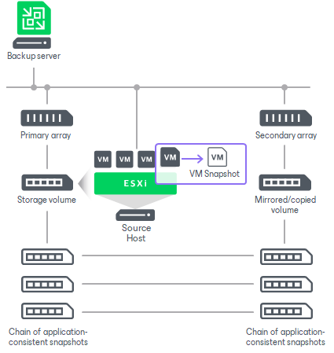

# Snapshot Orchestration

In this article

Veeam Backup & Replication lets you perform snapshot orchestration — build a snapshot chain on primary and secondary storage arrays. To create only long-term snapshots on storage arrays, you can run a snapshot-only job.

The snapshot-only job is similar to scheduling automatic snapshot creation in the storage management console. A snapshot-only job does not create Veeam backup files in the backup repository. It creates only long-term storage snapshots on the storage system by a schedule that is defined in the job settings.

Depending on the backup job settings, the created snapshots can be application-consistent or crash-consistent.

Related Topics

* [Configuring Snapshot-Only Jobs](snapshot_only_job_perform.md)
* [General Limitations](storage_limitations_general.md)

Page updated 6/6/2024

Page content applies to build 13.0.1.1071
