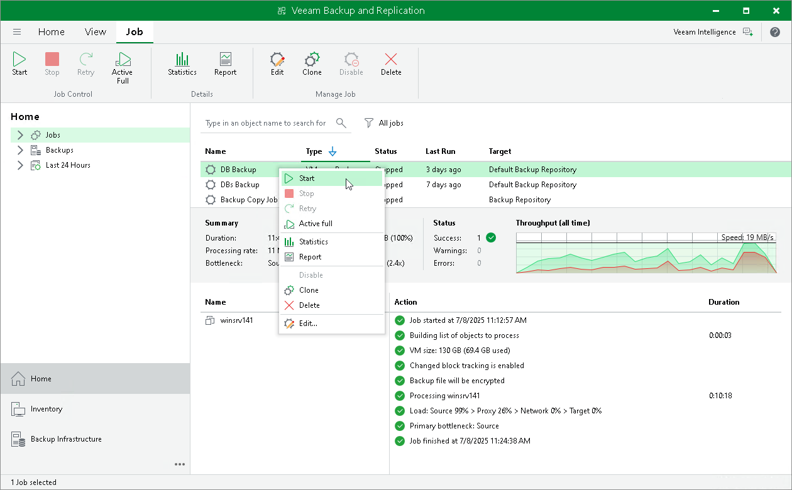

# Manual Start of Backup Jobs

You can start jobs manually if you need to capture VM data at a specific point in time and do not want to re-configure job scheduling settings. For example, you can start a job to create a VM backup before you install new software on a VM or enable a new feature.

When you start the job manually, Veeam Backup & Replication runs a regular job session that produces a new restore point in the backup chain in the backup repository.

To start and stop jobs configured on the backup server, you can use the Start and Stop buttons on the ribbon or the commands in the shortcut menu.

Related Topics

[Starting and Stopping Jobs](jobs_start_stop_hv.md)

