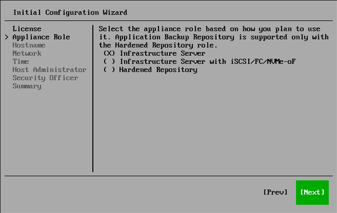

# Step 5. Select Appliance Role

At the Appliance Role step of the Initial Configuration wizard, Infrastructure Server is selected by default. Select one of the following appliance roles:

* Infrastructure Server
* Infrastructure Server with iSCSI/FC/NVMe-oF

|  |
| --- |
| Note |
| You must select this role when you plan to deploy a VMware backup proxy for backup from storage snapshots using the iSCSI, FC, or NVMe-oF protocol. For more information on proxies, see [VMware Backup Proxies](backup_proxy.md). |

* Hardened Repository

|  |
| --- |
| Note |
| When selecting Hardened Repository, consider the following:   * Veeam Hardened Repositories have specific requirements and limitations. For more information, see [Requirements and Limitations](hardened_repository_limitations.md). * You must select Hardened Repository if you intend to use the appliance as an Application Backup Repository. |

Page updated 2026-07-28

