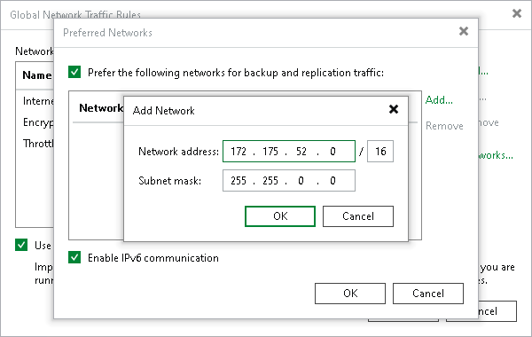
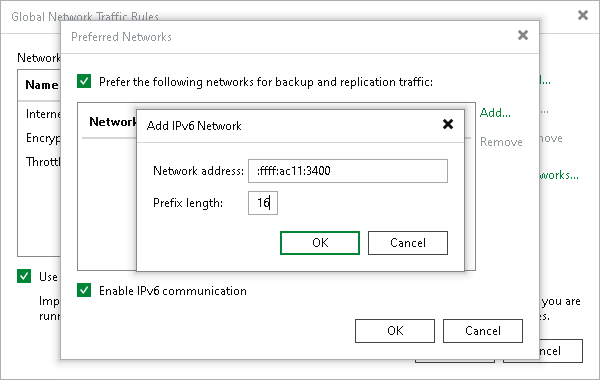

# Specifying Preferred Networks

You can choose networks over which Veeam Backup & Replication must transport data when you perform data protection and disaster recovery tasks. This option can be helpful if you have a non-production network and want to route data traffic over this network instead of the production one.

Preferred network rule applies only to traffic between the following backup infrastructure components:

* Backup server
* WAN accelerator1
* Gateway server2
* CDP proxy
* VMware backup proxy
* Off-host backup proxy3
* Microsoft Hyper-V Server3
* Backup repository
* Log shipping server
* Tape server
* Storage system (backup from storage snapshots scenario)4
* Veeam Agent
* Veeam Plug-Ins for Enterprise Applications
* Veeam Plug-Ins for Nutanix AHV workers

1 The rule applies only to traffic between the source and target WAN accelerators.

To define networks for data transfer, you must create a list of preferred networks. When Veeam Backup & Replication needs to transfer data, it uses networks from this list. If a connection over preferred networks cannot be established for some reason, Veeam Backup & Replication will automatically fail over to the production network.

To specify a preferred network:

1. From the main menu, select Network Traffic Rules.
2. In the Global Network Traffic Rules window, click Networks.
3. In the Preferred Networks window, select the Prefer the following networks for backup and replication traffic check box.
4. Click Add and select IPv4 or IPv6 network. Note that you can add the IPv6 network only if the Enable IPv6 communication check box is selected. For more information, see [IPv6 Support](ipv6.md).
5. [For the IPv4 network] Specify a network address and a subnet mask using a CIDR notation and click OK.

1. [For the IPv6 network] Specify a network address and prefix length using a CIDR notation and click OK.

|  |
| --- |
| Note |
| [For multiple preferred network] The order of the networks in the preferred networks list does not specify the order of how Veeam Backup & Replication connects to these networks. |

