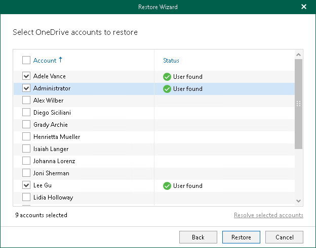

# Step 4. Select OneDrives

In this article

At this step of the wizard, select OneDrives that you want to restore and click Restore.

If you want to check whether user accounts whose OneDrives you want to restore exist, click Resolve selected accounts.

Page updated 9/20/2024

Page content applies to build 13.0.1.1071
