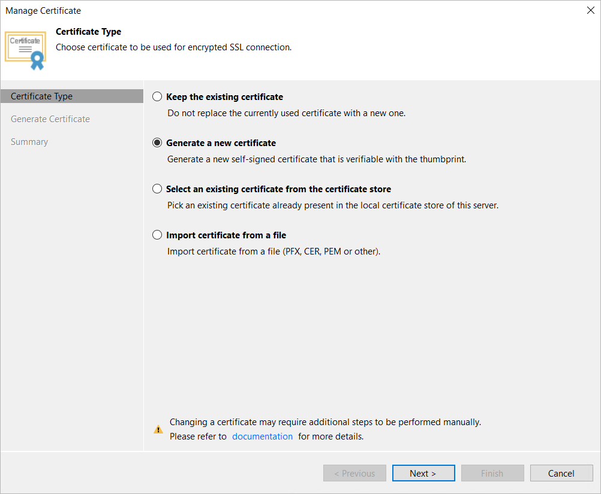
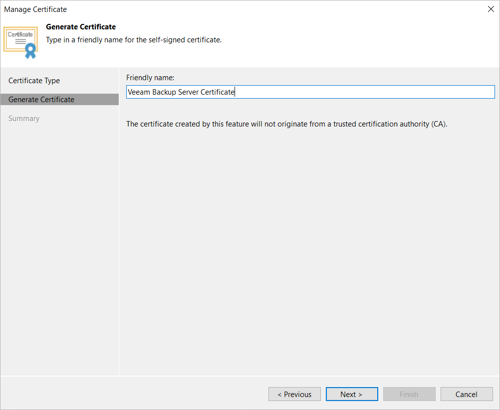
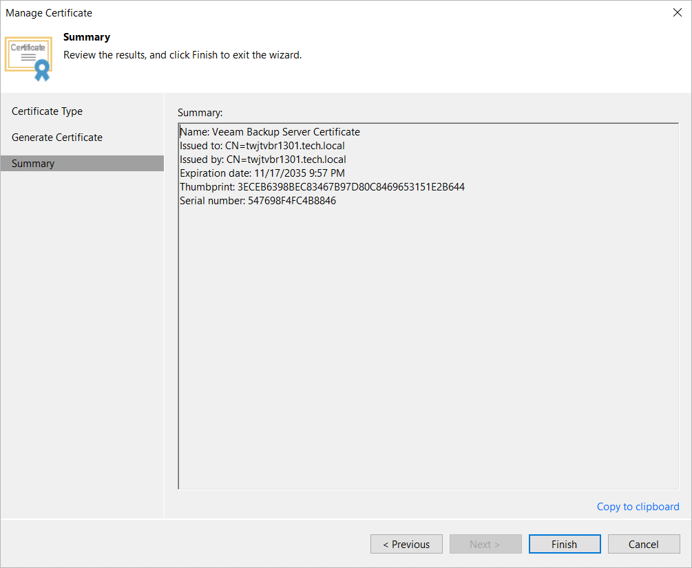

# Generating Self-Signed Certificate

In this article

You can use Veeam Backup & Replication to generate a self-signed certificate for authenticating parties in the Veeam Backup & Replication infrastructure.

|  |
| --- |
| Note |
| This is the default option and will be used unless another certificate is specified. |

To generate TLS certificates, Veeam Backup & Replication uses the RSA Full cryptographic service provider by Microsoft Windows or the OpenSSL library installed on the backup server. The created TLS certificate is saved to the certificate store. The types of users that can access the generated TLS certificate depend on your version of Veeam Backup & Replication:

* If you use Veeam Backup & Replication on Microsoft Windows, the following users have access:

* User who created the TLS certificate
* LocalSystem user accounts
* Local Administrators

* If you use Veeam Backup & Replication on Linux, the root account and service users have access.

If you use a self-signed TLS certificate generated by Veeam Backup & Replication, you do not need to take additional actions to deploy the TLS certificate on a protected computer. When Veeam Backup & Replication discovers a protected computer, a matching TLS certificate with a public key is installed on the protected computer automatically. During discovery, Veeam Installer Service deployed on the protected computer retrieves the TLS certificate with a public key from the backup server and installs a TLS certificate with a public key on the protected computer.

|  |
| --- |
| Note |
| When you generate a self-signed TLS certificate with Veeam Backup & Replication, you cannot include several aliases to the certificate and specify a custom value in the Subject field. The Subject field value is taken from the Veeam Backup & Replication license installed on the Veeam backup server. |

|  |
| --- |
| Important |
| If you update the TLS certificate used on the backup server, you must also update info about the certificate on the specific backup infrastructure components as described in section [Backup Server Certificate](backup_server_certificate.md). |

To generate a self-signed TLS certificate, do the following:

1. From the main menu, select Options.
2. Click the Security tab.
3. In the Security tab, click Install.
4. At the Certificate Type step of the wizard, select Generate new certificate.

1. At the Generate Certificate step of the wizard, specify a friendly name for the created self-signed TLS certificate.

1. At the Summary step of the wizard, review the certificate properties. Use the Copy to clipboard link to copy and save information about the generated TLS certificate. You will be able to use the copied information to verify the TLS certificate with the certificate thumbprint.
2. Click Finish. Veeam Backup & Replication will save the generated certificate in the certificate store on the backup server.

Page updated 11/18/2025

Page content applies to build 13.0.1.1071
