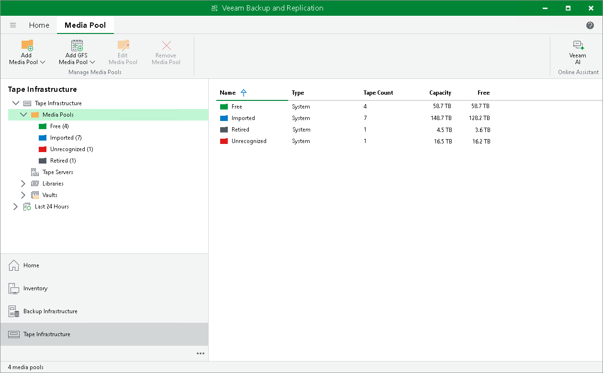

# Service Media Pools

In this article

Service media pools sort tapes and manage their free capacity for writing data. Service media pools are automatically created by Veeam Backup & Replication when needed. The following predefined media pools can be created:

* Free — a media pool containing empty tapes. You can use this media pool to replenish user-created pools with new tapes when needed.
* Imported — a media pool containing non-empty tapes. These include tapes identified by the tape catalog job.
* Retired — a media pool containing retired tapes that reached the maximum number of re-writes. This media pool may also contain tapes with some hardware malfunction.
* Unrecognized — a media pool containing tapes that were loaded to tape device. They need further identification by user that can be done by running the inventory or catalog job. This media pool also contains cleaning tapes.

You cannot create, modify or delete service media pools.

Page updated 5/30/2023

Page content applies to build 13.0.1.1071
