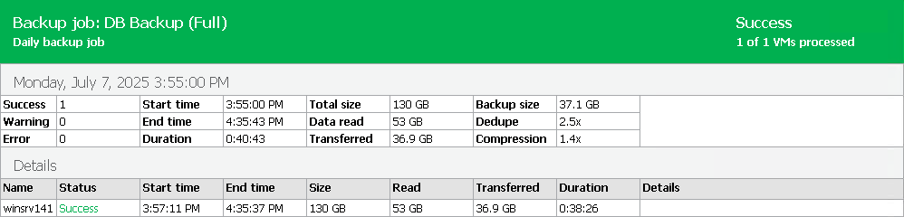

# Viewing Job and Job Session Reports

In this article

You can generate reports with details about all sessions of a job or a single session only.

|  |
| --- |
| Note |
| Please note that job and job session reports are not available for Veeam Plug-In for Nutanix AHV. |

Job Report

The job report contains data on all sessions initiated for a specific job, that is, job history. The report shows data for all sessions stored in the configuration database.

To generate a job report:

1. Open the Home view.
2. In the inventory pane, select Jobs.
3. In the working area, select the necessary job and click Report on the ribbon. You can also right-click the job and select Report.

For more information on counters in the report, see [Report Counters](#counter).

|  |
| --- |
| Tip |
| Generated reports are stored in the C:\Users\<username>\AppData\Local\Temp folder. |

Session Report

To generate a report for a single session:

1. Open the [Viewing History Statistics](history_statistics.md) view.
2. In the inventory pane, select Jobs.
3. In the working area, select the necessary session and click Report on the ribbon. You can also right-click the necessary session and select Report.

Report Counters

Veeam Backup & Replication displays the following counters in reports:

* The Success, Warning and Error counters show how many workloads were processed with the Success, Warning and Error statuses.
* The Start time and End time counters show when the job started and completed.
* The Duration counter shows the time from the job start till the current moment or job end.
* The Total size counter shows the provisioned size (the maximum configured size) of all workload disks in the job.
* The Data read counter shows the amount of data read from the datastore before compression and deduplication. The value of this counter is typically lower than the value of the Total size counter. Veeam Backup & Replication reads only data blocks that have changed since the last job session, processes and copies these data blocks to the target.
* The Transferred counter shows the amount of data transferred from the source side to the target side after applying compression and source-side deduplication. This counter does not directly indicate the size of the resulting files. Depending on the backup infrastructure and job settings, Veeam Backup & Replication can perform additional activities with data: perform target-side deduplication, decompress data prior to writing the file to disk, and so on. The activities can impact the size of the resulting file.
* The Backup size counter shows the resulting backup file size.
* The Dedupe counter shows the deduplication level.
* The Compression counter shows the compression level.

In the Details section, you can see similar counters for each workload the job processed.

|  |
| --- |
| Note |
| A synthetic full backup that is part of an incremental backup session is synthesized directly on the backup repository. Therefore, the Transferred and Backup size counters do not include data processed during the synthetic backup. They cover only data processed during the incremental run. Besides, the report header for such a backup does not have the (Full) mark as Veeam Backup & Replication considers it incremental. For more information, see the [Synthetic Full Backup](synthetic_full_backup.md) section. |

Page updated 1/5/2026

Page content applies to build 13.0.1.1071
